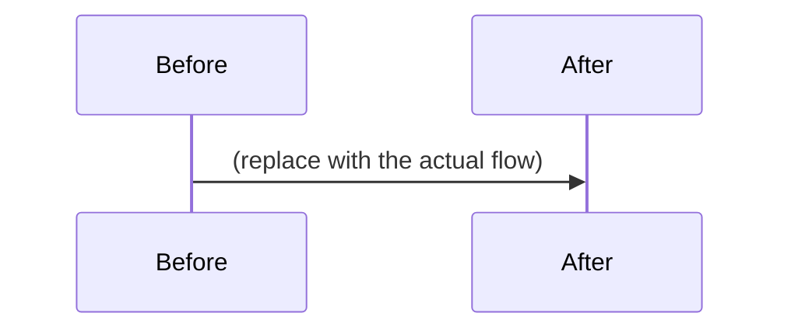

<!-- Thank you! Keep every section — write "n/a" if it truly does not apply.
     Visual evidence + a sequence/flow diagram are LAW, not preference. -->

## What changed

<!-- One or two sentences. What behaves differently after this PR? -->

## Why

<!-- The user-facing or architectural reason. Link the tracking ticket (BIN-*/HAB-*) if one exists. -->

## Sequence / flow diagram (REQUIRED for behavioral changes)

<!-- Show what the PR DOES as a diagram — a mermaid sequenceDiagram, flowchart,
     or stateDiagram of the behavior before/after. If nothing flows (pure
     docs/config), write "n/a — no behavior change".
     Render for review: `npx -p @mermaid-js/mermaid-cli mmdc -i <file>.mmd -o <file>.png`
     and attach the PNG (or commit under docs/pr-<N>/). -->

## Visual evidence

<!-- UI-affecting changes require rendered proof:
     PRs touching `web/**`: the Web Visual Diff workflow posts a screenshot
     diff table + left–right strips as a comment automatically once CI runs.
     Confirm it appeared and that every 🔴 row is intentional.
     PRs touching SwiftUI/AppKit surfaces: attach pointfree snapshot evidence
     (parity suite or recorded baselines) or rendered preview images. -->

- [ ] Visual diff comment reviewed — every 🔴 changed shot is intentional
- [ ] Sequence/flow diagram included above (or "n/a — no behavior change")

## Test plan

<!-- How you verified this yourself: exact commands, test names, or manual steps. -->

- [ ] Tests / build green locally — paste the command you ran

## Secrets / data posture

<!-- Any secrets, credentials, tokens, PII, or user data touched, added, or
     exposed? (Answer "none" explicitly if so.) -->

## Blast radius & rollback

<!-- What could this break outside its own module? How do we roll it back (revert commit / feature flag / migration down)? -->

## Self-evaluation

<!-- Complete every item. Write "n/a — <reason>" beside anything that does not apply. -->

- [ ] The title and What changed describe the user-visible or operational behavior accurately.
- [ ] Why explains the problem, decision, and intended outcome.
- [ ] The tracking issue or decision record is linked, or marked n/a.
- [ ] The change is scoped to the smallest practical surface.
- [ ] The sequence/flow diagram has committed Mermaid source, or is marked n/a.
- [ ] Diagram evidence is readable in both GitHub light and dark mode.
- [ ] UI-affecting changes include screenshots, previews, or visual-diff evidence.
- [ ] Happy paths and relevant failure/authorization paths were tested.
- [ ] Exact local validation commands and results are recorded above.
- [ ] CI results have been reviewed; failures, flakes, and pre-existing failures are distinguished.
- [ ] Tests cover regressions introduced or fixed by this change.
- [ ] Documentation, examples, and API/CLI help are updated where behavior changed.
- [ ] Compatibility, migrations, configuration defaults, and feature flags are addressed.
- [ ] Secrets, privacy, permissions, and externally exposed surfaces were reviewed.
- [ ] Logs, metrics, traces, and operator-facing evidence are present—or the observability gap is explicitly called out.
