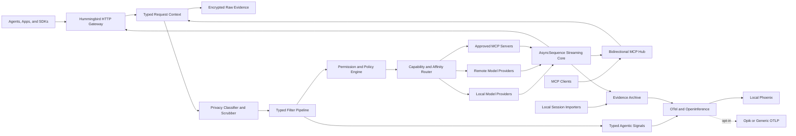

# Andromeda Gateway Architecture

> [!abstract] Shareable planning brief
> Andromeda Gateway is a local-first, Swift-native networking and policy plane for model APIs, MCP, privacy, evidence capture, and observability. This document freezes the v1 direction for discussion; it is not an implementation claim.

## Mission

Make model and tool traffic clear, typed, inspectable, privacy-aware, and reusable without hidden daemons or script-shaped infrastructure.

Andromeda combines four useful ideas while implementing them in its own Swift architecture:

- **[Plano](https://github.com/katanemo/plano):** capability routing, ordered filters, affinity, declarative topology, and agentic signals.
- **[Claude Tap](https://github.com/liaohch3/claude-tap):** local evidence capture, stream reconstruction, adjacent-request diffs, and portable trace artifacts.
- **[Headroom](https://github.com/headroomlabs-ai/headroom):** staged transformations and a future seam for reversible context optimization.
- **[Osaurus](https://github.com/osaurus-ai/osaurus):** native local serving, provider bridges, OpenAI-shaped endpoints, SSE, and MCP bridging.

The result is not a port. It is a typed synthesis built around Swift strict concurrency, protocol boundaries, explicit ownership, and observable failure.

## System Shape



## Runtime Boundaries

- Use **[Hummingbird](https://github.com/hummingbird-project/hummingbird)** for HTTP routing, middleware, lifecycle, request contexts, and route testing.
- Use raw **[SwiftNIO](https://github.com/apple/swift-nio)** only where transport-level control matters: SSE, WebSocket, MCP stdio, codecs, connection lifecycle, and backpressure.
- Use `AsyncSequence`, `AsyncThrowingStream`, and `NIOAsyncChannel` as the canonical streaming model.
- Expose Combine publishers only from Apple-facing adapter modules.
- Use actors for mutable registries, trace writers, affinity state, rate limits, and lifecycle ownership.
- Propagate cancellation and deadlines through every layer. Retries are bounded, classified, observable, and limited to replay-safe operations.
- Preserve generic composition inside modules; erase types only at compiled provider and filter registries.

## Module Map

| Module | Responsibility |
| --- | --- |
| `AndromedaCore` | Typed IDs, errors, capabilities, policies, clocks, provenance, and request context. |
| `AndromedaPipeline` | Generic filters, lifecycle stages, functional stream operators, and routing decisions. |
| `AndromedaGateway` | Hummingbird API, provider registry, affinity, fallback, and compatibility routing. |
| `AndromedaProviders` | Local and remote provider adapters, model catalogs, tool calling, usage, and health. |
| `AndromedaMCP` | MCP client/server roles, stdio and Streamable HTTP, permissions, and trace propagation. |
| `AndromedaPrivacy` | Secret and PII classification, scrubbing, disclosure policy, and export rules. |
| `AndromedaEvidence` | Encrypted raw sessions, sanitized traces, diffs, transcript imports, and exports. |
| `AndromedaObservability` | OSLog, swift-log, OpenTelemetry, OpenInference, Phoenix, signals, and metrics. |
| `AndromedaApple` | Realm, CloudKit, Keychain, Combine, OSLog, and optional Apple Container adapters. |
| `AndromedaCLI` | The single `andromeda` executable plus human and JSON renderers. |

## Compiled Topology

Topology is authored in a result-builder Swift DSL. Provider, route, filter, listener, and policy changes require a rebuild. Only secrets and bounded operational overrides such as ports, bind address, log level, exporter endpoint, and feature flags vary at runtime.

```swift
let topology = AndromedaTopology {
    provider(OpenAIProvider.self, id: "openai")
    provider(LocalModelProvider.self, id: "local")

    filter(SecretScrubber())
    filter(PIIClassifier())
    filter(PermissionGate(default: .deny))

    route(alias: "fast", to: ["local", "openai"])
    route(alias: "reasoning", to: ["openai"])

    listener(.openAICompatible(port: 8080))
    listener(.mcpStreamableHTTP(port: 8081))
}
```

`andromeda config show --json` will emit a redacted, versioned effective-topology snapshot.

## OpenAI-Compatible Surface

V1 targets the generation data plane:

- Models and model capability discovery.
- Responses creation, retrieval, cancellation, input items, compaction, and token counting where supported.
- Chat Completions and legacy Completions.
- Embeddings and moderation.
- Speech, transcription, and translation.
- Image generation, editing, and variations.
- Files, uploads, and batches.

Compatibility DTOs must be verified against a pinned [official OpenAI API specification](https://developers.openai.com/api/reference/overview). Andromeda-only APIs live under `/andromeda/v1`; they do not mutate standard OpenAI response bodies. Unsupported provider/model combinations return typed capability errors with the requested capability, considered providers, and trace ID.

## MCP Contract

V1 is a bidirectional MCP hub:

- MCP server and client roles.
- Stdio and Streamable HTTP transports.
- Discovery is visible; invocation is denied until compiled policy or explicit approval grants it.
- Filesystem, network, destructive, credential, privileged, and high-cost scopes are classified independently.
- Approval events carry actor, reason, scope, expiry, and trace context.
- External MCP failures cannot crash the gateway.

## Evidence and Privacy

- Raw prompts, headers, tool payloads, and responses are encrypted locally by default and retained until explicitly deleted.
- Each session receives a separate data key wrapped by a Keychain-held master key; deleting the session key performs cryptographic erasure.
- Sanitization happens before ordinary telemetry persistence or export.
- Local [Phoenix](https://github.com/Arize-ai/phoenix) is the default sanitized trace destination. If it is unavailable, the gateway continues with visible local status.
- On Apple-silicon macOS 26, an explicit CLI command may manage Phoenix through [Apple Container](https://github.com/apple/container). Andromeda never silently installs or starts the container system service.
- [Opik](https://github.com/comet-ml/opik) and generic OTLP exporters are opt-in.
- Emoji and ANSI color are human presentation only. JSON, OTel, OSLog fields, and protocol payloads stay machine-stable.

## CLI Surface

```text
andromeda serve
andromeda status
andromeda doctor
andromeda models list
andromeda config show
andromeda mcp serve
andromeda mcp servers
andromeda mcp tools
andromeda traces list|show|diff|export|delete
andromeda telemetry status
andromeda telemetry phoenix start|status|logs|stop
```

The executable runs in the foreground by default. Every long-lived process exposes owner, PID or endpoint, health, start reason, logs, resource state, and an explicit stop control.

## Implementation Gates

1. **Foundation:** Swift package, module boundaries, typed IDs/errors, Argument Parser, Hummingbird, NIO, clocks, mocks, and structured logging.
2. **Gateway spine:** compiled topology, broad compatibility DTOs, provider registry, capability router, SSE, cancellation, and typed failure mapping.
3. **Evidence and privacy:** encrypted archive, sanitizer pipeline, trace reconstruction, structural diffs, imports, exports, and Phoenix OTLP.
4. **MCP:** client/server transports, permission engine, approval records, containment, and trace propagation.
5. **Optimization extensions:** prefix-drift detection, reversible compression/retrieval, cache stabilization, and honest savings measurement.

## Acceptance Contract

- OpenAI request, response, error, and SSE fixtures round-trip against the pinned specification.
- Mock providers cover routing, affinity, fallback, cancellation, timeouts, rate limits, and slow consumers.
- NIO embedded-channel tests verify framing and backpressure.
- MCP tests verify deny-by-default policy, approval expiry, containment, and trace propagation.
- Privacy tests prove secrets and PII are scrubbed before export.
- Evidence tests cover encrypted append/recovery, concurrent writers, tamper detection, diffing, export, and cryptographic deletion.
- Telemetry tests verify span trees, OpenInference attributes, bounded cardinality, Phoenix export, and exporter failure isolation.
- Repository policy tests reject maintained Bash automation and unsurfaced background behavior.

## Deliberate Deferrals

- No generic TLS interception or local certificate authority in v1.
- No full OpenAI organization, fine-tuning, eval, or administration mirror.
- No Headroom-scale compression suite in the first gateway milestone; the extension seam is designed now.
- Memory implementation remains pinned while Gateway, MCP, CLI, networking, and observability are specified.

## Related Brain Nodes

- [[ANDROMEDA-MAIN-BRAIN]]
- [[GATEWAY-IMPLEMENTATION-STUBS]]
- [[ANDROMEDA-CHARTER|Andromeda Charter]]
- [[ROADMAP|Andromeda Roadmap]]

## Reference Revisions

The initial design study used these immutable upstream revisions so later documentation can detect drift:

- Plano `d2127b83ffaee67b230e0bc1858cef8c676e0615`
- Claude Tap `0fd6c258332ffd65496036783608639c1e28ee49`
- Headroom `eca3db62a33c5802453fce87c5bfd1e5ff42b100`
- Osaurus `71c63d0f4d0494db356b711281f08c947e15eede`
