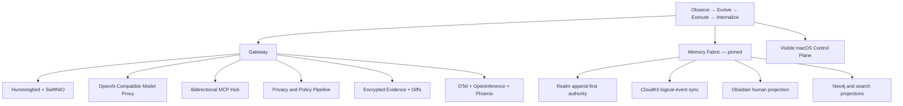

# Andromeda Main Brain

> [!abstract] Current center of gravity
> Andromeda is a local-first, Swift-native control plane joining Gateway networking, model serving, MCP, evidence, privacy, graph memory, and visible macOS operations.

## Current Focus

The active engineering focus is [[Gateway Plan|Gateway: Networking + MCP + LLM Proxy]]. Memory architecture is recorded but paused while the runtime spine becomes explicit.

### Locked Gateway Decisions

- Portable Swift core with Apple-specific adapters.
- Hummingbird for HTTP application structure; raw SwiftNIO for transport edges.
- `AsyncSequence` and `NIOAsyncChannel` are canonical streams; Combine is an Apple adapter.
- One explicit `andromeda` executable, foreground by default.
- Compiled result-builder topology with bounded runtime overrides.
- Hybrid filter pipeline: generic in-process Swift filters plus typed HTTP/MCP adapters.
- Broad OpenAI generation data-plane compatibility, capability-gated by provider and model.
- Bidirectional MCP hub with stdio and Streamable HTTP.
- MCP invocation denied until compiled policy or explicit approval grants it.
- Gateway traffic and explicit local transcript imports are captured; generic TLS interception is excluded.
- Raw evidence is encrypted locally and retained until explicit deletion; sanitized telemetry targets local Phoenix.
- Optional Apple Container management is limited to a visible macOS 26/Apple-silicon path.
- Plano and Claude Tap inform the design spine; privacy is the first transform feature. Headroom-style reversible optimization follows later.

## Architecture Constellation

## Pinned Memory Note

- Realm is the Apple runtime's append-first local authority for immutable logical events and materialized state.
- CloudKit synchronizes logical immutable events, not a live Realm database file.
- Obsidian remains the human editing and knowledge projection surface.
- Neo4j, embeddings, the visual atlas, published site, and slides are rebuildable projections.
- Epistemic status and projection freshness remain separate dimensions.

Further memory implementation decisions are intentionally paused.

## Knowledge Paths

- [[Gateway Plan]] — full shareable architecture.
- [[Gateway Stubs]] — Swift contracts for implementation planning.
- [[ANDROMEDA-CHARTER|Andromeda Charter]] — non-negotiable product rules.
- [[ROADMAP|Andromeda Roadmap]] — outcome gates.
- [[Documentation/Diagrams/README|Andromeda Diagrams]] — canonical sequence diagrams.

## Staleness

| Surface | Authority | Freshness rule |
| --- | --- | --- |
| Main Brain | Version-controlled architecture docs | Stale when a locked decision changes without updating this note. |
| README | Main Brain plus Charter | Stale when mission, focus, or module map diverges. |
| Diagrams | Gateway architecture and event contracts | Stale when actors or data authority change. |
| Future visual atlas | Structured docs manifest | Must display source digest, build time, and freshness state. |

## Next Engineering Gate

Bootstrap the Swift package and prove the typed request path with mocks before adding real providers:

`request → encrypted append → privacy filter → policy → capability route → mock stream → sanitized trace`
