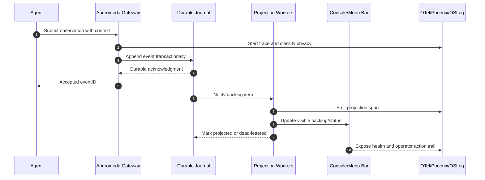
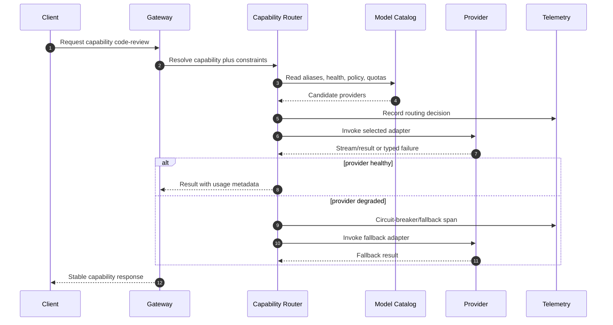
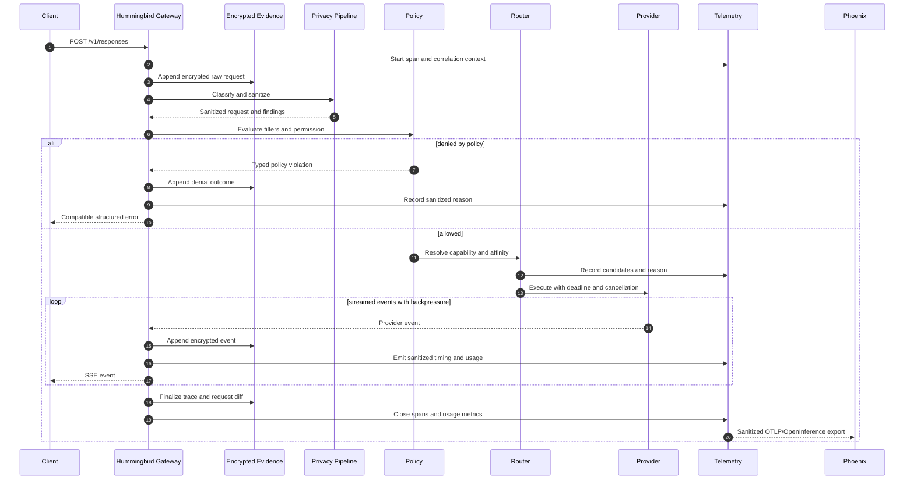

# Andromeda Diagrams

These Mermaid diagrams are source-controlled so future rendered GIFs, presentations, and README visuals can be generated from canonical text instead of hand-maintained screenshots.

## Observation Capture Sequence

## Capability Routing Sequence

## Gateway Request and Evidence Sequence

## Motion Specification

The future interactive atlas renders these canonical actors as SVG nodes and edges. Small particles travel along active edges to show request, evidence, and telemetry flow. Motion must include play, pause, step, scrub, keyboard operation, reduced-motion behavior, and a static screen-reader-friendly fallback.
