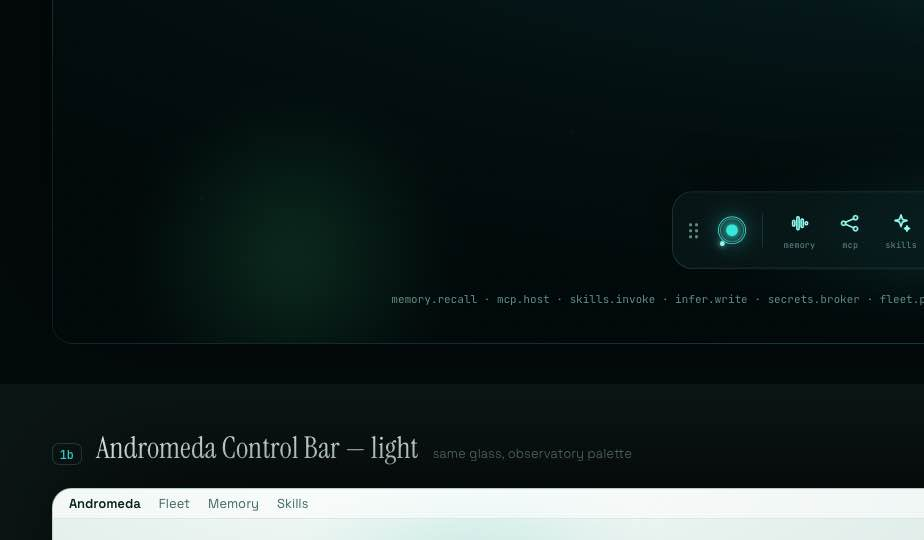
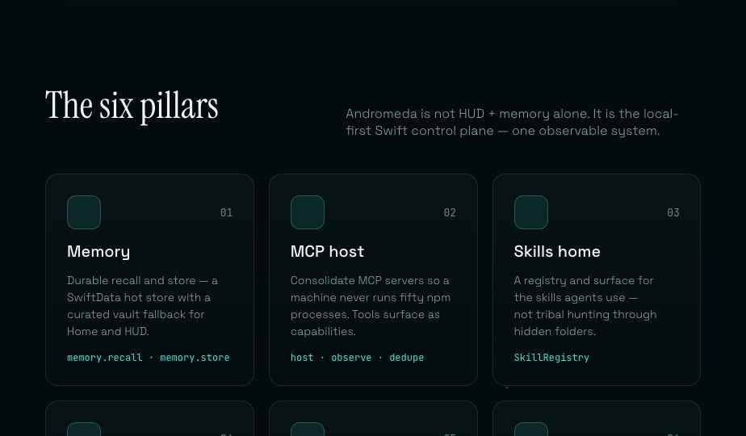

# AndromedaUI Gate 0 gallery

Package-surface proofs for BIN-270 review. These are **not** recorded SnapshotTesting
baselines — those land after a macOS `SNAPSHOT_TESTING_RECORD=1` pass.

| Surface | Preview |
| --- | --- |
| Bundled `AndromedaLogo` resource |  |
| Floating control bar |  |
| Six-pillar control-plane cards |  |

Files: `logo.png` · `control-bar.png` · `pillars.png`
