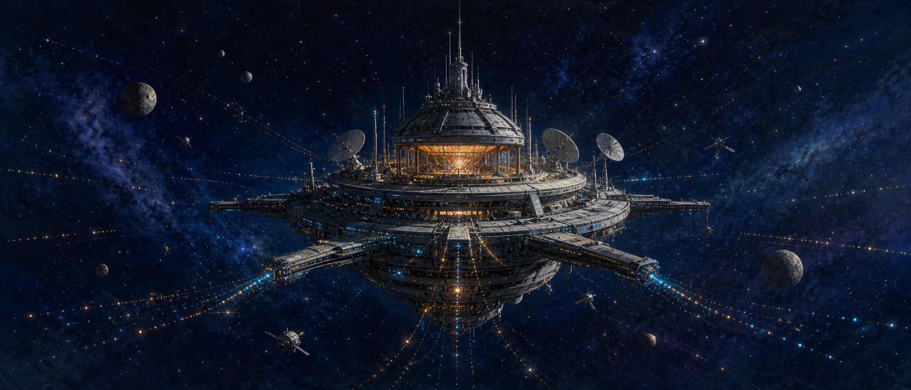
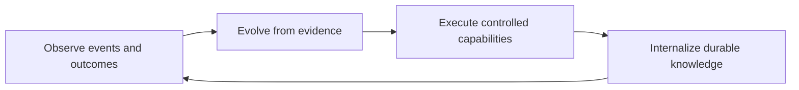
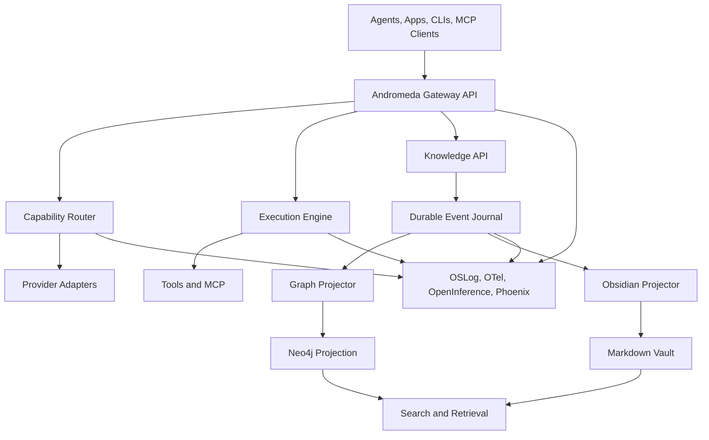

# Andromeda

> A macOS-first, Swift-native control plane for visible, durable, graph-aware multi-agent engineering.



Andromeda replaces fragmented scripts, hidden workers, ad-hoc memory stores, provider-specific model wiring, and silent background automation with one observable system.

## Big picture — six control-plane pillars (locked 2026-07-19)

Andromeda is **not** HUD + memory alone. It is the local-first Swift **control plane**:

| # | Pillar | Role |
|---|--------|------|
| 1 | **Memory (Anima)** | Durable recall/store behind `memory.*` / `infer.write` / `project.state.*` |
| 2 | **MCP home** | Host/consolidate MCPs so Studio does not run ~50 `npm` processes |
| 3 | **Agent skills home** | Registry/surface for skills agents use (`SkillRegistry`) |
| 4 | **LLM proxy** | Andromeda-owned inference routing (Autocache/gateway lineage); clients do not pick providers |
| 5 | **Secrets vault / broker** | Stable IDs like `slack_proxy`, `github_proxy`, `write.too` — never raw keys in client env |
| 6 | **Fleet runtime** | LaunchAgents / plists / launchd + observability + telemetry — visible, auditable, accessible |

Clients see **stable capability IDs**; Andromeda resolves providers, secrets, MCP processes, and LaunchAgents behind the curtain. Honesty table (✅/🚧/📐) and examples: **[docs/ANDROMEDA-CONTROL-PLANE.md](docs/ANDROMEDA-CONTROL-PLANE.md)**. Workspace flip remains gated — pillars are product scope, not a flip claim.

## Mission Loop



## Architectural Shape



## Visibility Charter

- No project-maintained Bash automation files.
- No invisible `launchctl` jobs, hidden watchdogs, or mystery daemons.
- Every background job appears in a command-bar, menu-bar, console, or equivalent status surface.
- Every important action has structured logs, metrics, traces, ownership, privacy labels, and failure state.
- Acknowledged observations are written to a durable journal before downstream processing.

## Current Status

The Gateway spine is moving from plan to code. The first live Hummingbird surface is a Swift port of [Autocache](https://github.com/montevive/autocache): an Anthropic Messages proxy that injects prompt-cache breakpoints and returns ROI analytics headers.

Broader OpenAI-compatible routing, bidirectional MCP, encrypted evidence, privacy filters, and Phoenix telemetry remain on the roadmap.

## Quick Start

```console
swift build
swift test
swift run andromeda status
ANTHROPIC_API_KEY=sk-ant-... swift run andromeda serve --port 8080
```

Point Anthropic clients at `http://127.0.0.1:8080` instead of `https://api.anthropic.com`. Compatible headers include `X-Autocache-Injected`, `X-Autocache-Cache-Ratio`, and `X-Autocache-ROI-Percent`.

## Documentation

- [**Control plane — six pillars**](docs/ANDROMEDA-CONTROL-PLANE.md) ← agents: read this first for product scope
- [**Memory architecture (Anima)**](docs/MEMORY-ARCHITECTURE.md) ← memory vision + website reference: 8 layers, 7 services, the curtain, why graph+vector, proof
- [Charter](ANDROMEDA-CHARTER.md)
- [Roadmap](ROADMAP.md)
- [Changelog](CHANGELOG.md)
- [Agent guidance](AGENTS.md)
- [Claude guidance](CLAUDE.md)
- [Workspace readiness / flip gate](docs/ANDROMEDA-WORKSPACE-READINESS.md)
- [Sequence diagrams](Documentation/Diagrams/README.md)
- [Gateway architecture](Documentation/Architecture/GATEWAY-ARCHITECTURE.md)
- [Autocache Swift port](Documentation/Architecture/AUTOCACHE-SWIFT.md)
- [Gateway Swift stubs](Documentation/Architecture/GATEWAY-IMPLEMENTATION-STUBS.md)
- [Main Brain](Documentation/Brain/ANDROMEDA-MAIN-BRAIN.md)

## Safety Reminder

Andromeda is under active migration. Do not treat generated projections, model outputs, or retrieved notes as authoritative unless provenance and confidence support that claim.
