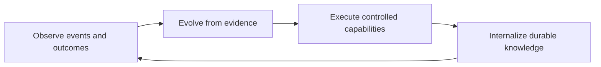
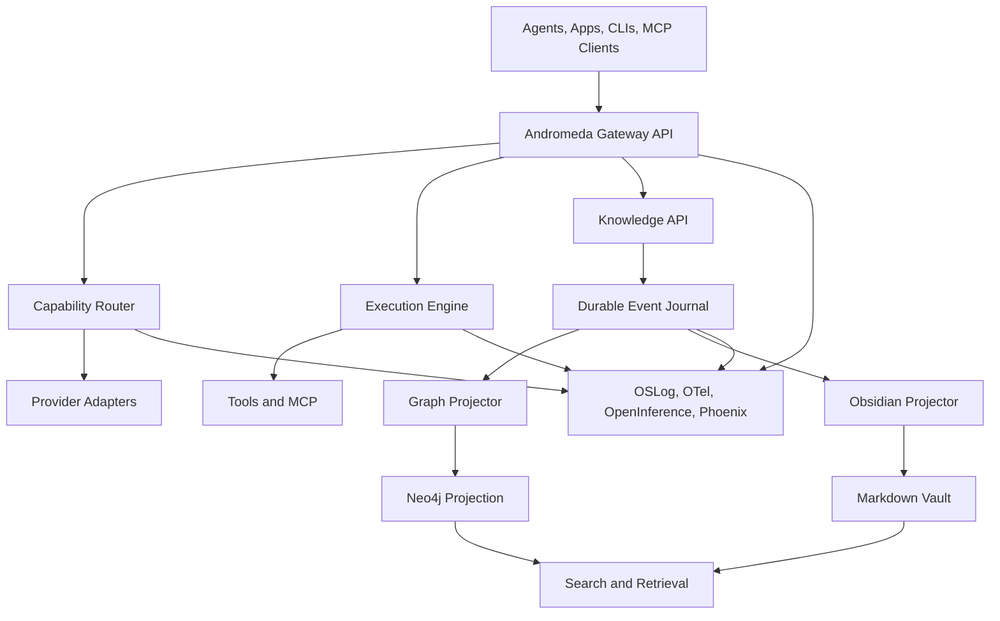

# Andromeda

> A macOS-first, Swift-native control plane for visible, durable, graph-aware multi-agent engineering.


Andromeda replaces fragmented scripts, hidden workers, ad-hoc memory stores, provider-specific model wiring, and silent background automation with one observable system.

## Mission Loop



## Architectural Shape



## Visibility Charter

- No project-maintained Bash automation files.
- No invisible `launchctl` jobs, hidden watchdogs, or mystery daemons.
- Every background job appears in a command-bar, menu-bar, console, or equivalent status surface.
- Every important action has structured logs, metrics, traces, ownership, privacy labels, and failure state.
- Acknowledged observations are written to a durable journal before downstream processing.

## Current Status

The founding architecture is being documented. The active plan is the Gateway spine: Hummingbird and SwiftNIO networking, a broad capability-gated LLM proxy, bidirectional MCP, encrypted evidence, privacy filters, and OpenTelemetry/OpenInference export to local Phoenix.

Implementation should begin with measurement and mocks, not assumptions: inventory the current system, verify failure modes, and prove cancellation, privacy, backpressure, and failure visibility before connecting live providers.

## Proposed Quick Start

```console
swift build
swift test
swift run andromeda status
```

These commands are aspirational until the Swift package is bootstrapped.

## Documentation

- [Charter](ANDROMEDA-CHARTER.md)
- [Roadmap](ROADMAP.md)
- [Changelog](CHANGELOG.md)
- [Agent guidance](AGENTS.md)
- [Claude guidance](CLAUDE.md)
- [Sequence diagrams](Documentation/Diagrams/README.md)
- [Gateway architecture](Documentation/Architecture/GATEWAY-ARCHITECTURE.md)
- [Gateway Swift stubs](Documentation/Architecture/GATEWAY-IMPLEMENTATION-STUBS.md)
- [Main Brain](Documentation/Brain/ANDROMEDA-MAIN-BRAIN.md)

## Safety Reminder

Andromeda is under active migration. Do not treat generated projections, model outputs, or retrieved notes as authoritative unless provenance and confidence support that claim.
