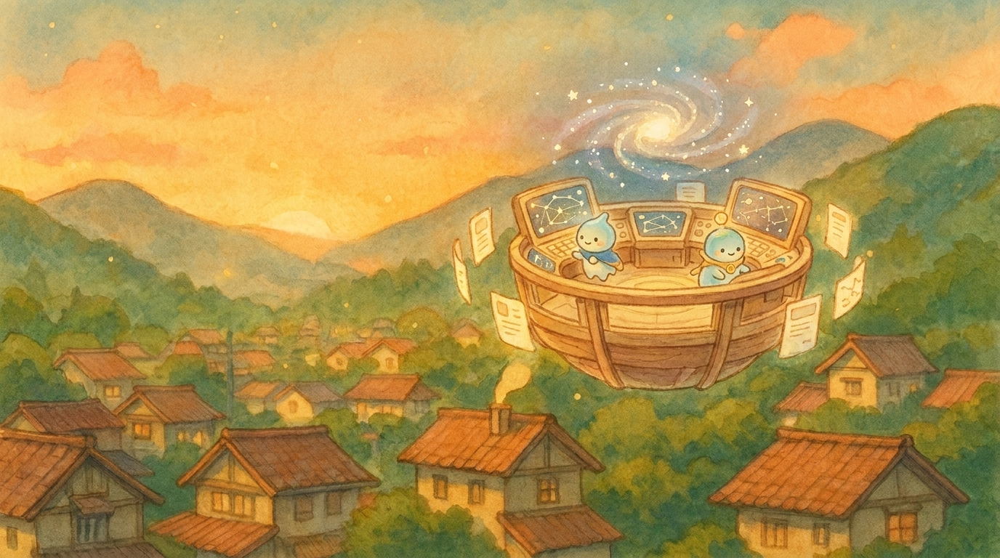
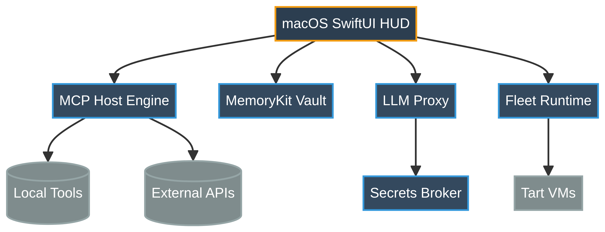

# Andromeda

### Swift AI Command Center

 

[**View Live Demo →**](https://andromeda-lac-theta.vercel.app)

---

## 🚀 Overview

A macOS-first, Swift-native control plane for visible, durable, graph-aware multi-agent engineering. 
Built to unify memory, MCP hosting, LLM proxying, and fleet runtime execution into a single, native interface.

## 🏗 Architecture

  

## ✨ Core Pillars

- **Memory**: Persistent graph-aware storage via MemoryKit
- **MCP Host Engine**: Connect and orchestrate Model Context Protocol tools natively
- **Secrets Broker**: Secure credential management for agent sessions
- **Fleet Runtime**: Execute and monitor multiple agents in parallel
- **LLM Proxy**: Unified routing to local and remote models

## 🛠 Tech Stack

Built entirely in Swift 6 for macOS 14+. Leverages SwiftUI for the HUD and Swift concurrency for high-throughput agent orchestration.
