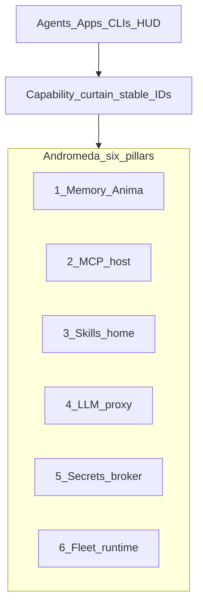

# Andromeda Control Plane — Six Pillars (locked 2026-07-19)

> **Audience:** any agent touching Andromeda / Anima / Multibrain.  
> **Rule:** Andromeda is **not** “just HUD + memory.” It is the local-first Swift control plane.  
> **Honesty:** ✅ shipped · 🚧 partial · 📐 specified / not built. Do not greenwash.

Dual-home: keep this file identical in `~/Developer/multibrain/docs/ANDROMEDA-CONTROL-PLANE.md`.

---

## One sentence

**Andromeda** owns Memory, MCP host, Skills registry, LLM proxy, Secrets broker, and Fleet runtime (LaunchAgents + observability) behind a **capability curtain** — clients call stable IDs; Andromeda resolves providers, secrets, processes, and routing server-side.

---

## Locked product rules (keep)

- Client menus expose **stable capability IDs only** — never Linear / Multica / n8n / provider brand names / raw env key names.
- Workspace flip still **NO-GO** — see [ANDROMEDA-WORKSPACE-READINESS.md](./ANDROMEDA-WORKSPACE-READINESS.md).
- Install / sign / LaunchAgent deploy is **ALL SWIFT** (BIN-101) — no hybrid bash reopen.
- Operator trackers stay in [ANIMA-PROJECT-LINKS.md](./ANIMA-PROJECT-LINKS.md); clients use `project.state.*`.

---

## The six pillars

| # | Pillar | Client-facing IDs (examples) | Status 2026-07-19 | Code / doc lineage |
|---|--------|------------------------------|-------------------|--------------------|
| 1 | **Memory (Anima)** | `memory.recall`, `memory.store`, `memory.journal` / session dump, `infer.write`, `project.state.*` | 🚧 curtain + MemoryKit live; CloudKit GUI / Letta WS open | [MEMORY-ONEPAGER.md](./MEMORY-ONEPAGER.md), MemoryKit |
| 2 | **MCP home** | MCP tools appear as capabilities after host consolidate — not 50× `npm exec` per Studio | 🚧 `MCPServerRegistry` observe/scan + sprawl bent 55→37; **shared lifecycle / dedupe host not shipped** | BIN-41, [MCP-SPRAWL-PROBLEM.md](./MCP-SPRAWL-PROBLEM.md), Gate F |
| 3 | **Agent skills home** | Skill invoke via registry surface (not tribal `~/.claude/skills` hunting) | 📐 `SkillRegistry` target entity; inventory exists in surface-area | HAB-39, [ANDROMEDA-SURFACE-AREA.md](./ANDROMEDA-SURFACE-AREA.md) §F |
| 4 | **LLM proxy** | `infer.write` (and aliases) — clients never pick Cerebras/OpenRouter/Anthropic | 🚧 Autocache Anthropic Hummingbird surface live; full multi-provider router / OpenAI-compat / breakers **not** done | `GatewayConfig`, Gate D, Autocache proofs |
| 5 | **Secrets vault / broker** | `slack_proxy`, `github_proxy`, `write.too` (e.g. Cerebras), … — **never** raw key values in client/agent process env | 📐 charter Keychain intent; VisibilityFilter redacts narrative secrets; **no broker injecting capabilities yet** | Charter `AndromedaConfig`; BIN-43 key pin lane |
| 6 | **Fleet runtime** | Operator/UI: LaunchAgent roster, health pulse, telemetry — mutate via typed Swift install/CLI | 🚧 `LaunchEntity` / `FleetObserveReport` / TelemetryHub / bar roster **observe**; full plist centralization + typed mutate **not** done | BIN-26/33, BIN-101, [ANDROMEDA-SURFACE-AREA.md](./ANDROMEDA-SURFACE-AREA.md) §G |

---

## Capability curtain — secrets / proxy examples

Same pattern as memory: **stable ID in → Andromeda resolves secret + provider out.**

| Capability ID | Hides behind the curtain | Client must NOT see |
|---------------|--------------------------|---------------------|
| `memory.recall` / `memory.store` | SwiftData hot, vault, Ladybug, Qdrant, cloaks | Store paths, index brands |
| `infer.write` | Autocache / gateway / model registry / health / fallbacks | Anthropic, Cerebras, OpenRouter, raw API keys |
| `project.state.*` | Linear ∪ Multica ∪ Slack fanout | Tracker brand names in menus |
| `slack_proxy` | Slack Web API via broker; token from Keychain/vault | `SLACK_BOT_TOKEN`, raw env |
| `github_proxy` | GitHub API via broker | `GITHUB_TOKEN`, `gh` auth dumps in agent env |
| `write.too` | Fast write / codegen inference (e.g. Cerebras) via proxy | Provider brand + API key in process env |

**Hard rule:** UI LaunchAgents and satellite agents run with **env scrub** (`HOME` + `PATH` only). Broker injects secrets **server-side** at call time. Never put raw key values into client process environments.

---

## Pillar 6 detail — Fleet runtime

**Goal:** LaunchAgents / plists / launchd + observability + telemetry are first-class Andromeda entities — not scattered tribal knowledge under `~/Library/LaunchAgents`.

| Concern | Target | Honesty |
|---------|--------|---------|
| Centralize plists | One auditable roster (`LaunchEntity` + repo `ops/*.plist` + Andromeda install) | 🚧 registry + ops templates exist; Studio still has live plists outside a single SoT UI |
| Observability | Health, `last_success`, agent status, spend/kill switches, MCP process pressure — one pulse | 🚧 `health.json`, FleetObserve, TelemetryHub, MCP scan — not yet one Home/HUD “fleet pulse” product |
| Auditable | Who/what loaded, KeepAlive, ProgramArguments, env scrub, codesign identity | 🚧 observe fields partial; codesign/env scrub documented in HUD install proofs |
| Accessible | List / inspect / kickstart without hunting plists | 🚧 bar roster + LaunchEntity UI; mutate still bash/`launchctl` until BIN-101 |
| Observe vs mutate | MemoryKit **observe-only** for `launchctl`; mutate via typed Swift `andromeda-install` / CLI | 📐 locked policy; Swift install **Todo** (BIN-101) |

---

## What is NOT claimed shipped

- Secrets broker / `slack_proxy` / `github_proxy` / `write.too` runtime
- MCP consolidate (one shared host replacing per-TTY npm sprawl)
- `SkillRegistry` product surface
- Full multi-provider LLM gateway beyond Autocache Anthropic
- Fleet plist SoT + typed mutate replacing `install-and-sign.sh`
- Workspace flip to Andromeda as default Cursor root

---

## Related docs

| Doc | Role |
|-----|------|
| [MEMORY-ONEPAGER.md](./MEMORY-ONEPAGER.md) | Memory / Anima detail |
| [ANDROMEDA-SURFACE-AREA.md](./ANDROMEDA-SURFACE-AREA.md) | Entity inventory (MCP, skills, LaunchAgents) |
| [ANDROMEDA-WORKSPACE-READINESS.md](./ANDROMEDA-WORKSPACE-READINESS.md) | Flip gate (pillars ≠ flip) |
| [MCP-SPRAWL-PROBLEM.md](./MCP-SPRAWL-PROBLEM.md) | Why MCP home exists |
| [ANIMA-PROJECT-LINKS.md](./ANIMA-PROJECT-LINKS.md) | Operator Linear∪Multica∪Slack |

---

*Six pillars. One curtain. No silent sprawl.*
