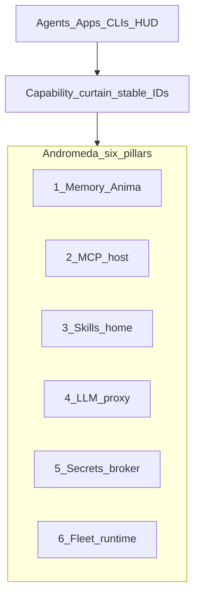
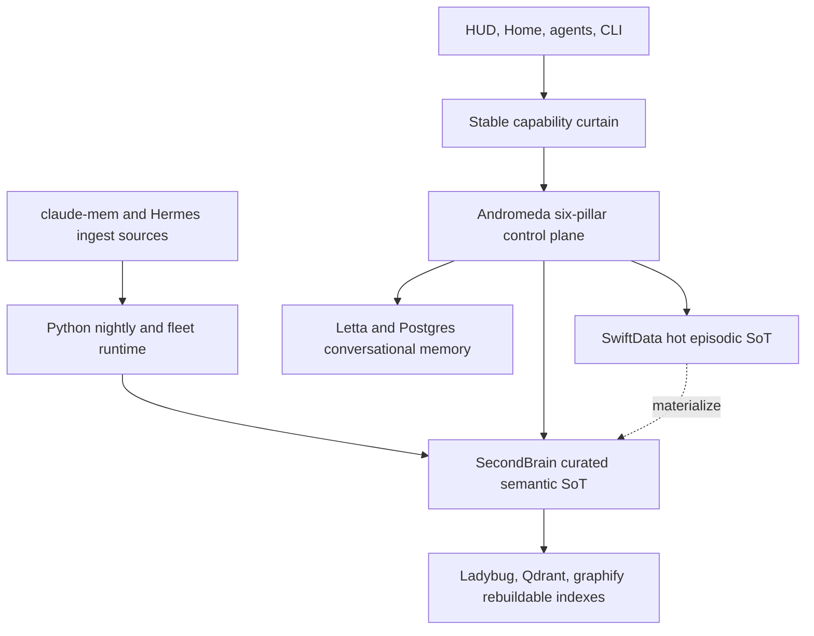

# Andromeda Control Plane — Six Pillars (locked 2026-07-19)

> **Audience:** any agent touching Andromeda / Anima / Multibrain.  
> **Rule:** Andromeda is **not** “just HUD + memory.” It is the local-first Swift control plane.  
> **Honesty:** ✅ shipped · 🚧 partial · 📐 specified / not built. Do not greenwash.

Dual-home mirror: keep this document byte-identical in both
`~/Developer/multibrain/docs/ANDROMEDA-CONTROL-PLANE.md` and
`~/Developer/Andromeda/docs/ANDROMEDA-CONTROL-PLANE.md`.

---

## One sentence

**Andromeda** owns Memory, MCP host, Skills registry, LLM proxy, Secrets broker, and Fleet runtime (LaunchAgents + observability) behind a **capability curtain** — clients call stable IDs; Andromeda resolves providers, secrets, processes, and routing server-side.

---

## Locked product rules (keep)

- Client menus expose **stable capability IDs only** — never Linear / Multica / n8n / provider brand names / raw env key names.
- Workspace flip still **NO-GO** — see [ANDROMEDA-WORKSPACE-READINESS.md](./ANDROMEDA-WORKSPACE-READINESS.md).
- Install / sign / LaunchAgent deploy is **ALL SWIFT** (BIN-101) — no hybrid bash reopen.
- Operator trackers stay in [ANIMA-PROJECT-LINKS.md](./ANIMA-PROJECT-LINKS.md); clients use `project.state.*`.

---

## The six pillars

| # | Pillar | Client-facing IDs (examples) | Status 2026-07-19 | Code / doc lineage |
|---|--------|------------------------------|-------------------|--------------------|
| 1 | **Memory (Anima)** | `memory.recall`, `memory.store` (+ journal/session aliases), `project.state.*` — **not** `infer.write` | 🚧 curtain + MemoryKit live; HUD journal/privacy landed on promotion branch; CloudKit GUI / Letta WS open | [MEMORY-ONEPAGER.md](./MEMORY-ONEPAGER.md), [MEMORY-CURTAIN-CONSOLIDATION.md](./MEMORY-CURTAIN-CONSOLIDATION.md), MemoryKit |
| 2 | **MCP home** | MCP tools appear as capabilities after host consolidate — not 50× `npm exec` per Studio | 🚧 `MCPServerRegistry` observe/scan + sprawl bent 55→37; **shared lifecycle / dedupe host not shipped** | BIN-41, [MCP-SPRAWL-PROBLEM.md](./MCP-SPRAWL-PROBLEM.md), Gate F |
| 3 | **Agent skills home** | Skill invoke via registry surface (not tribal `~/.claude/skills` hunting) | 📐 `SkillRegistry` target entity; inventory exists in surface-area | HAB-39, [ANDROMEDA-SURFACE-AREA.md](./ANDROMEDA-SURFACE-AREA.md) §F |
| 4 | **LLM proxy** | Autocache / future `infer.generate` / `write.too` — clients never pick Cerebras/OpenRouter/Anthropic; **LLM ≠ memory write** | 🚧 Autocache Anthropic Hummingbird surface live; full multi-provider router / OpenAI-compat / breakers **not** done | `GatewayConfig`, Gate D, Autocache proofs |
| 5 | **Secrets vault / broker** | `slack_proxy`, `github_proxy`, `write.too` (e.g. Cerebras), … — **never** raw key values in client/agent process env | 📐 charter Keychain intent; VisibilityFilter redacts narrative secrets; **no broker injecting capabilities yet** | Charter `AndromedaConfig`; BIN-43 key pin lane |
| 6 | **Fleet runtime** | Operator/UI: LaunchAgent roster, health pulse, telemetry — mutate via typed Swift install/CLI | 🚧 `LaunchEntity` / `FleetObserveReport` / TelemetryHub / bar roster **observe**; full plist centralization + typed mutate **not** done | BIN-26/33, BIN-101, [ANDROMEDA-SURFACE-AREA.md](./ANDROMEDA-SURFACE-AREA.md) §G |

---

## Capability curtain — secrets / proxy examples

Same pattern as memory: **stable ID in → Andromeda resolves secret + provider out.**

| Capability ID | Hides behind the curtain | Client must NOT see |
|---------------|--------------------------|---------------------|
| `memory.recall` / `memory.store` | Hot store (SwiftData today), WriteKind, vault/page/graphify/vectors, cloaks | Store paths, index brands, SwiftData/Realm |
| `infer.write` | **Deprecated client alias** → `memory.store` + `WriteKind.inferAliasDeprecated` (not LLM) | Must not be advertised as inference |
| `project.state.*` | Linear ∪ Multica ∪ Slack fanout | Tracker brand names in menus |
| `slack_proxy` | Slack Web API via broker; token from Keychain/vault | `SLACK_BOT_TOKEN`, raw env |
| `github_proxy` | GitHub API via broker | `GITHUB_TOKEN`, `gh` auth dumps in agent env |
| `write.too` | Fast write / codegen inference (e.g. Cerebras) via proxy | Provider brand + API key in process env |

**Hard rule:** UI LaunchAgents and satellite agents run with **env scrub** (`HOME` + `PATH` only). Broker injects secrets **server-side** at call time. Never put raw key values into client process environments.

---

## Pillar 6 detail — Fleet runtime

**Goal:** LaunchAgents / plists / launchd + observability + telemetry are first-class Andromeda entities — not scattered tribal knowledge under `~/Library/LaunchAgents`.

| Concern | Target | Honesty |
|---------|--------|---------|
| Centralize plists | One auditable roster (`LaunchEntity` + repo `ops/*.plist` + Andromeda install) | 🚧 registry + ops templates exist; Studio still has live plists outside a single SoT UI |
| Observability | Health, `last_success`, agent status, spend/kill switches, MCP process pressure — one pulse | 🚧 `health.json`, FleetObserve, TelemetryHub, MCP scan — not yet one Home/HUD “fleet pulse” product |
| Auditable | Who/what loaded, KeepAlive, ProgramArguments, env scrub, codesign identity | 🚧 observe fields partial; codesign/env scrub documented in HUD install proofs |
| Accessible | List / inspect / kickstart without hunting plists | 🚧 bar roster + LaunchEntity UI; mutate still bash/`launchctl` until BIN-101 |
| Observe vs mutate | MemoryKit **observe-only** for `launchctl`; mutate via typed Swift `andromeda-install` / CLI | 📐 locked policy; Swift install **Todo** (BIN-101) |

---

## Capability matrix — client contract versus implementation

Client capabilities are the curtain. Internal entity IDs, tracker names, providers,
store brands, ports, and credentials are operator implementation details.

| Stable client ID | Status | Semantics as built | Important boundary |
|------------------|--------|--------------------|--------------------|
| `memory.recall` | ✅ | Hot store first; vault ripgrep is degraded fallback today — target: page index → graphify → vectors ([MEMORY-CURTAIN-CONSOLIDATION.md](./MEMORY-CURTAIN-CONSOLIDATION.md)) | Clients never pick backend brands |
| `memory.store` | ✅ | **One** client write verb; transactional hot insert + WriteKind behind curtain | Materialization/index writes are asynchronous and fail-open |
| `memory.journal` | ✅ Home/Bar; ✅ HUD promotion branch | Alias of `memory.store` + `WriteKind.journal` | Merge/CI on Andromeda main still gates shipped status |
| `memory.session_dump` | ✅ Home/Bar; ✅ HUD promotion branch | Alias of `memory.store` + `WriteKind.sessionDump` | Merge/CI on Andromeda main still gates shipped status |
| `infer.write` | 🚧 **deprecated client alias** | Maps to `memory.store` + `WriteKind.inferAliasDeprecated` (tag `infer-write`) | **Not** LLM inference; do not put on new client menus |
| `project.state.list/get/create/update` | ✅ | Stable project-state CRUD; operator bridge may route to Linear/Multica/Slack | Clients never see tracker brands |
| `slack_proxy`, `github_proxy`, `write.too` | 🚧 / 📐 | M4 curated `andromeda_*` MCP tools + Keychain injection on runtime v2 (`POST /mcp`) — curtain IDs `github_proxy`/`slack_proxy` not yet the guest-facing names; `write.too` still charter | M5 `setup`/`doctor` land host-first wiring; live e2e gate on BIN-210 |

Real LLM generation stays under the LLM-proxy pillar (Autocache / `write.too` /
future `infer.generate`). Never recycle `infer.write` for inference until memory
callers are fully on `memory.store`. See [MEMORY-CURTAIN-CONSOLIDATION.md](./MEMORY-CURTAIN-CONSOLIDATION.md).

## Fleet and machine ownership

| Machine | Role and current confidence | Runs / owns | Explicitly does not own |
|---------|-----------------------------|-------------|-------------------------|
| **Studio** (`admin`) | Phase-2 hub; documented local state | canonical SecondBrain deposit, SwiftData hot store, Python nightly, Letta/Ladybug/Qdrant/Multica, weekly retro | no claim that all services are Swift |
| **Book** (`book.local`) | Phase-1 satellite; live status **unverified today** | documented nightly 03:00, hourly health, Telegram, local vault mirror | no Letta/Ladybug hub stack; tunnels may be degraded |
| **Mac Mini** | intentionally isolated lane | its own local/remote-access concerns | not a hive satellite by default; do not install hub services |
| **habitat VM** | Hermes ingest source | `~/.hermes/state.db`, read over SSH by `extract_hermes_vm.py` | not a memory control plane or client surface |
| **iPhone** | MinIO/Obsidian sync client | consumes/synchronizes curated files | not a Letta/Ladybug host and not proof of CloudKit replication |
| **iMac** | 📐 aspirational CloudKit satellite | future replica/client | no shipped or live-verified role |

Degraded tunnel or satellite reachability must be reported as degraded/unverified,
not silently promoted to healthy. Hub-only checks are `n/a` on real satellites.

## Schedule and launchd clock matrix

| Job / service | Clock | Host | Status / invariant |
|---------------|-------|------|--------------------|
| `com.multibrain.nightly` | 02:30 local | Studio | `run-nightly.sh` → `consolidate.py` is the conductor |
| `com.multibrain.nightly` | 03:00 local | Book | documented satellite schedule; current live state unverified |
| `com.multibrain.health` | hourly | Studio + Book | writes health state; alerts on RED |
| `com.multibrain.dreamcatcher` | every 1800s | Studio | installed with `--no-llm`; paid LLM disabled |
| `com.multibrain.claude-mem-worker` | every 60s + KeepAlive | Studio | capture worker watchdog |
| `com.multibrain.retro` | Monday 08:00 | Studio | installed; vault-only no-LLM retrospective |
| Letta / bridge / shim | KeepAlive | Studio | interactive Librarian stack |
| Ladybug / Qdrant / Multica | KeepAlive | Studio | purpose-specific indexes/services |

## Store roles, retention, and data flow

| Store | Role | Source-of-truth / retention rule |
|-------|------|----------------------------------|
| SwiftData `~/.multibrain/anima-hot.store` | implemented hot episodic capture | episodic SoT today; **Realm not implemented** — pivot path is one HotStore adapter + optional live fanout ([MEMORY-CURTAIN-CONSOLIDATION.md](./MEMORY-CURTAIN-CONSOLIDATION.md)), not twin SoTs |
| SecondBrain / Obsidian | curated, human-readable semantic memory | semantic SoT; durable and git-auditable |
| `~/.multibrain/state.db` | dedup, baselines, alert and operational metadata | operational SoT only; not user memory |
| LadybugDB | hub graph/vector query index | rebuildable cache; not `memory.recall` |
| Qdrant `secondbrain_learnings` | `/knowledge-sync` facts | rebuildable fact-vector cache only |
| Letta + Postgres `:5442` | conversational Librarian state | conversational memory; not nightly ownership |
| claude-mem / Hermes | ingest rivers | source capture retained under their own schemas |
| graphify HTML/JSON | derived graph analysis | rebuild from curated inputs |
| CloudKit | planned replica path | engine exists, but replication is not declared shipped |

Write order is durable episodic capture first, then asynchronous materialization and
indexing. Cache/index failure must not invalidate the source record. No retention job
may delete a source-of-truth record merely because a derived index accepted it.

## Privacy and egress matrix

| Visibility | Default / forcing | Local SwiftData, Ladybug, Obsidian | CloudKit/vector egress |
|------------|-------------------|-----------------------------------|-------------------------|
| `public` | explicit | allowed | allowed |
| `friends` | explicit trusted-sharing scope | allowed | allowed |
| `private` | **default** | allowed | blocked |
| `internal` | explicit or forced by cloak/secrets/credential markers | allowed | blocked |

HUD writes on the promotion branch now pass through `VisibilityFilter`: unknown
visibility defaults to `private`, while cloak/secrets/credential markers force
`internal`. Python session-note frontmatter still lacks a guaranteed `visibility`
field. That remains an open schema/enforcement gap, not evidence that egress is safe.

## Graph views — do not conflate them

| View / index | Purpose | Not this |
|--------------|---------|----------|
| Obsidian graph + merged `colorGroups` | human navigation of curated notes | not an API backend |
| `graphify-out/graph.html` / `graph.json` | analytical graph artifact and communities | not source-of-truth memory |
| LadybugDB | queryable hub graph/vector index | not `memory.recall` |
| Qdrant | `/knowledge-sync` fact vectors | not nightly/session indexing |
| Canvas / native Swift graph | 📐 planned visual surface | not shipped |

## Letta today and future Swift boundary

**Today:** Python Letta server `:8283`, Python tool bridge `:8284`, z.ai shim `:8285`,
and Postgres `:5442` form the interactive Librarian path. Letta never conducts the
nightly batch; `run-nightly.sh` and `consolidate.py` do.

**Future:** a Swift HTTP/WebSocket agent-runtime module may compose MemoryKit, the MCP
host, SkillRegistry, the Autocache LLM proxy, secrets broker, and fleet runtime. It
must be separate from the current Hummingbird Autocache gateway (`:8080`), which is an
LLM proxy only. There is no Swift Letta server today.

The pasted `SwiftLettaServer` is a **speculative, non-prescriptive sketch**. It uses
outdated Hummingbird APIs and undefined types such as `Context7Core`, `MemFS`, and
`AgentID`; it is not an implementation plan or evidence. **Context7 has no
implementation/code presence; documentation references are non-prescriptive.** If
adopted later, it is an optional MCP/skill adapter, never a core constructor
dependency or required pillar.

## Open gaps and re-audit criteria

- Land the tested HUD journal/session-dump + visibility-policy slice on Andromeda main;
  keep distinct capability identity and cloak→internal E2E coverage.
- Add optional `visibility` and `content_hash` to Python materialized-note contracts;
  interpret missing visibility as private.
- Prove public/friends-only CloudKit and vector export; do not call CloudKit shipped first.
- Retire `infer.write` from client menus (shim → `WriteKind.inferAliasDeprecated`);
  keep real LLM under Autocache / `write.too` / future `infer.generate` — see
  [MEMORY-CURTAIN-CONSOLIDATION.md](./MEMORY-CURTAIN-CONSOLIDATION.md).
- Promote page/structured index + graphify in `memory.recall`; demote ripgrep to
  degraded fallback only.
- Verify Book live jobs and tunnel health; keep Mini isolated.
- Build neither secrets-broker nor MCP-consolidate claims until runtime proofs exist.
- Keep future Swift agent runtime separate from Autocache and prove HTTP/WS APIs with
  current Hummingbird before replacing the Python bridge.
- Preserve PROOF 44 NO-GO; merge PR #10, land all-Swift installer BIN-101, clear CI
  blockers, rerun privacy/schema proofs, and obtain the human word before workspace flip.

---

## What is NOT claimed shipped

- Secrets broker / `slack_proxy` / `github_proxy` — **partially shipped** as curated M4 tools on runtime v2; Autocache-main env-vault prototype is superseded
- `write.too` runtime
- MCP consolidate (one shared host replacing per-TTY npm sprawl) beyond the curated `/mcp` door
- Full multi-provider LLM gateway beyond Autocache Anthropic
- Fleet plist SoT + typed mutate replacing `install-and-sign.sh`
- Workspace flip to Andromeda as default Cursor root
- Interactive VM getting-started webpage with live checklist (BIN-212 stretch)
---

## Related docs

| Doc | Role |
|-----|------|
| [MEMORY-CURTAIN-CONSOLIDATION.md](./MEMORY-CURTAIN-CONSOLIDATION.md) | One write / one recall + WriteKind + retrieval ladder (design pivot) |
| [MEMORY-ONEPAGER.md](./MEMORY-ONEPAGER.md) | Memory / Anima detail |
| [ANDROMEDA-SURFACE-AREA.md](./ANDROMEDA-SURFACE-AREA.md) | Entity inventory (MCP, skills, LaunchAgents) |
| [ANDROMEDA-WORKSPACE-READINESS.md](./ANDROMEDA-WORKSPACE-READINESS.md) | Flip gate (pillars ≠ flip) |
| [MCP-SPRAWL-PROBLEM.md](./MCP-SPRAWL-PROBLEM.md) | Why MCP home exists |
| [ANIMA-PROJECT-LINKS.md](./ANIMA-PROJECT-LINKS.md) | Operator Linear∪Multica∪Slack |

---

*Six pillars. One curtain. No silent sprawl.*
