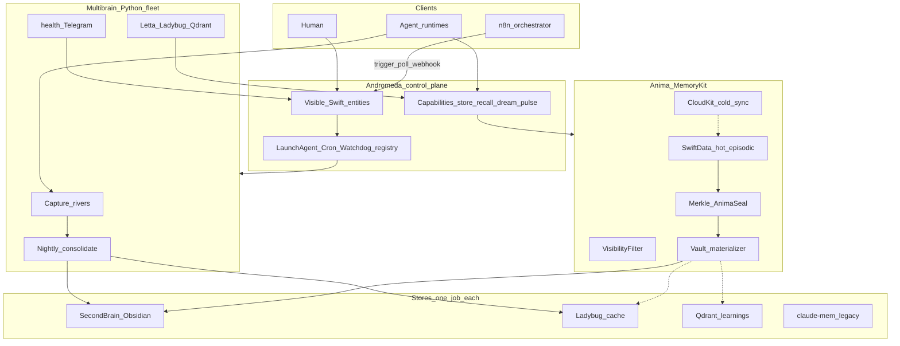

# Andromeda × Anima — Total Control / Observability Surface Area

> **Inventory date:** 2026-07-15  
> **Scope:** Make every invisible/scattered control surface a **visible Swift entity**, optionally orchestrable via **n8n**, without creating a second source of truth.  
> **Sources:** `~/Developer/multibrain` (ops/, bin/, docs/, Packages/), `~/Developer/Andromeda`, `~/Library/LaunchAgents`, `~/Developer/multibrain-bar`, live ports on Studio.  
> **Rule:** Docs only — no code changes in this inventory pass.

---

## 1. Executive map

**Andromeda** is the local-first Swift control plane (Observe → Evolve → Execute → Internalize). **Anima** (MemoryKit) is its memory subsystem: hot SwiftData episodic capture, Merkle seals, visibility cloaks, CloudKit cold sync, and async materialization into the Obsidian vault + rebuildable Ladybug/Qdrant caches. **Multibrain** is today’s production Python fleet (extractors, `consolidate.py` nightly, Letta Librarian, health/Telegram) that Anima must consume and eventually subsume. **n8n** (Homebrew binary present; not yet wired into this fabric) is the intended external orchestrator/observer — triggers, polls, and webhooks over the same entities Andromeda already owns — never a parallel SoT.

---

## 2. Entity catalog (master table)

Phases: **0** = visible now (file/API/plist) · **1** = Anima MemoryKit · **2** = Andromeda unify · **later** = Pet / photographic / n8n-deep.

| Entity ID | Kind | Current home | Visibility today | Target Swift entity | n8n role | Phase |
|-----------|------|--------------|------------------|---------------------|----------|-------|
| `store.anima.hot` | Store | MemoryKit `SwiftDataContainer` / `AnimaEpisodicRecord` (`Andromeda` + `multibrain/Packages/MemoryKit`) | hidden (in-process) | `AnimaHotStore` | webhook (store) / poll (count) | 1 |
| `store.anima.cloudkit` | Store | `CloudKitSyncEngine` + `SyncConfig` (private DB) | hidden | `AnimaCloudSync` | poll (syncStatus) / trigger | 1 |
| `store.vault.secondbrain` | Store | `~/Developer/SecondBrain` | file | `VaultStore` | poll / webhook (note written) | 0 |
| `store.claude-mem` | Store | `~/.claude-mem/claude-mem.db` + Chroma; worker `:37777` | API+file | `CaptureRiver.ClaudeMem` | poll `/health` | 0 |
| `store.hermes.local` | Store | `~/.hermes/state.db` FTS5 | hidden | `CaptureRiver.Hermes` | none→poll | 0 |
| `store.hermes.vm` | Store | habitat VM via SSH / `extract_hermes_vm.py` | hidden | `CaptureRiver.HermesVM` | none | 0 |
| `store.multica.pg` | Store | Postgres `:5442` (Multica + Letta DBs) | API | `CaptureRiver.Multica` | poll | 0 |
| `store.multibrain.state` | Store | `~/.multibrain/state.db` (dedup/baselines/alerts) | file | `FleetStateStore` | poll | 0 |
| `store.memory-md` | Store | `~/.claude/projects/-Users-admin/memory/` | file | `MemoryMdAdapter` | none | 0 |
| `store.dreams.journal` | Store | `07-Sessions/dreams/` + `~/.multibrain/dreams/` | file | `DreamJournal` | poll | 0 |
| `index.ladybug` | Index | `~/.multibrain/multibrain.lbug` + serve `:8286` | API | `LadybugIndex` | poll `/health` | 0→1 |
| `index.qdrant.learnings` | Index | Qdrant `:6333` collection `secondbrain_learnings` | API | `QdrantLearningsIndex` | poll / webhook upsert | 0→1 |
| `index.graphify` | Index | vault `graph.json` + `graphify-out/` | file | `GraphifyIndex` | trigger merge | 0 |
| `crypto.anima.seal` | Telemetry | `AnimaSeal` + `MerkleTree` | hidden | `IntegritySeal` | poll verify | 1 |
| `security.visibility` | Store | `VisibilityFilter` (public/friends/private/internal) | hidden | `VisibilityPolicy` | none | 1 |
| `svc.memory.reducer` | Service | TCA `MemoryReducer` | hidden | `AnimaMemoryFeature` | trigger sync/materialize | 1 |
| `cap.store_memory` | Skill | DATA-CONTRACTS §12 (spec); not yet public API surface | hidden | `MemoryCapability.store` | webhook | 1 |
| `cap.recall_memory` | Skill | DATA-CONTRACTS / MEMORY-ONEPAGER | hidden | `MemoryCapability.recall` | webhook | 1 |
| `cap.session_dump` | Skill | client-priority API (preference) | hidden | `MemoryCapability.sessionDump` | webhook | 1→2 |
| `river.claude-mem.worker` | Watchdog | `com.multibrain.claude-mem-worker` → `claude-mem-ensure-worker.sh` every 60s | LaunchAgent | `LaunchEntity.ClaudeMemWorker` | poll / trigger kickstart | 0 |
| `river.dreamcatcher` | Watchdog | `com.multibrain.dreamcatcher` → `dreamcatcher.py scan` every 1800s | LaunchAgent (semi-hidden) | `LaunchEntity.Dreamcatcher` | poll / trigger | 0→2 |
| `river.kimi.bridge` | CLI | `bin/kimi-to-claudemem.py` | CLI | `CaptureBridge.Kimi` | webhook | 0 |
| `cli.extract.claudemem` | CLI | `bin/extract_claudemem.py` | CLI | `Extractor.ClaudeMem` | trigger | 0 |
| `cli.extract.hermes` | CLI | `bin/extract_hermes.py` | CLI | `Extractor.Hermes` | trigger | 0 |
| `cli.extract.hermes-vm` | CLI | `bin/extract_hermes_vm.py` | CLI | `Extractor.HermesVM` | trigger | 0 |
| `cli.extract.multica` | CLI | `bin/extract_multica.py` | CLI | `Extractor.Multica` | trigger | 0 |
| `cli.aggregate_digest` | CLI | `bin/aggregate_digest.py` | CLI | `DigestBuilder` | trigger | 0 |
| `job.nightly` | Cron | `com.multibrain.nightly` 02:30 → `run-nightly.sh` | LaunchAgent | `ScheduledJob.Nightly` | trigger `--force` / poll `last_success` | 0 |
| `cli.run_nightly` | CLI | `bin/run-nightly.sh` | CLI+logs | `NightlyOrchestrator` | trigger | 0 |
| `cli.consolidate` | CLI | `bin/consolidate.py` (**batch conductor**, not Letta) | CLI | `DreamBatch.Consolidate` | trigger | 0→2 |
| `cli.ingest_staged` | CLI | `bin/ingest_staged.py` | CLI | `StagingIngest` | trigger | 0 |
| `cli.graphify_merge` | CLI | `bin/graphify_merge.py` | CLI | `GraphifyMerge` | trigger | 0 |
| `cli.index_ladybug` | CLI | `bin/index_ladybug.py` | CLI | `LadybugRebuild` | trigger | 0 |
| `cli.daily_brief` | CLI | `bin/daily_brief.py` | CLI+vault | `Meditation.DailyBrief` | trigger / poll brief file | 0→1 |
| `job.weekly_retro` | Cron | `ops/com.multibrain.retro.plist` Mon 08:00 — **template only, not installed** | file (ops) / missing live | `ScheduledJob.WeeklyRetro` | trigger | 0 |
| `cli.weekly_retro` | CLI | `bin/weekly_retro.py` | CLI | `Meditation.WeeklyRetro` | trigger | 0 |
| `layer.anima.dream` | Service | maps to nightly today | hidden (concept) | `AnimaDreamEngine` | trigger | 1→2 |
| `layer.anima.meditation` | Service | Daily Brief / morning | hidden | `AnimaMeditation` | trigger | 1 |
| `layer.anima.awareness` | Service | health→Telegram (too loud) | LaunchAgent+alert | `HeartbeatEngine` | poll / webhook | 1→2 |
| `svc.letta` | Service | `com.multibrain.letta` → `:8283` | KeepAlive API | `HubService.Letta` | poll `/v1/health` / webhook chat | 0 |
| `svc.letta.bridge` | Service | `com.multibrain.letta-bridge` → `:8284` | KeepAlive | `HubService.LettaBridge` | poll | 0 |
| `svc.letta.shim` | Service | `com.multibrain.letta-shim` → `:8285` z.ai | KeepAlive | `HubService.LettaShim` | poll | 0 |
| `svc.ladybug.serve` | Service | `com.multibrain.index-server` → `:8286` | KeepAlive | `HubService.Ladybug` | poll `/health` | 0 |
| `svc.qdrant` | Service | `com.qdrant.server` → `:6333` | KeepAlive | `HubService.Qdrant` | poll | 0 |
| `svc.multica.daemon` | Service | `com.multica.daemon` | KeepAlive | `HubService.MulticaDaemon` | poll | 0 |
| `svc.multica.stack` | Service | `com.multica.stack` | KeepAlive | `HubService.MulticaStack` | poll | 0 |
| `svc.multica.api` | Service | Multica API `:3637` | API | `HubService.MulticaAPI` | poll | 0 |
| `svc.postgres.5442` | Service | Homebrew PG17 `:5442` | port | `HubService.Postgres` | poll | 0 |
| `svc.obsidian.rest` | Service | Obsidian Local REST `:27124` | API | `VaultTransport` | none→poll | 0 |
| `tunnel.hermes` | LaunchAgent | `com.binarybros.hermes-tunnel` → localhost:18642 | KeepAlive | `Tunnel.Hermes` | poll | 0 |
| `cli.brain` | CLI | `bin/brain.py` → Letta chat | CLI | `LibrarianClient` | webhook | 0 |
| `cli.letta_setup` | CLI | `bin/letta_setup.py` | CLI | `LettaAdmin` | trigger | 0 |
| `cli.write_vault_note` | CLI | `bin/write_vault_note.py` | CLI | `VaultWriter` | webhook | 0 |
| `cli.qdrant_upsert` | CLI | `bin/qdrant-upsert.py` | CLI | `QdrantUpsert` | webhook | 0 |
| `job.health` | Cron | `com.multibrain.health` hourly → healthcheck+alert | LaunchAgent | `ScheduledJob.Health` | poll `health.json` | 0 |
| `cli.healthcheck` | CLI | `bin/healthcheck.py` | CLI+file | `FleetHealthProbe` | trigger | 0 |
| `cli.alert.telegram` | CLI | `bin/alert.py` | Telegram | `AlertChannel.Telegram` | webhook (forward) | 0 |
| `telemetry.health_json` | Telemetry | `~/.multibrain/health.json` (9 checks) | file | `HealthSnapshot` | poll | 0 |
| `telemetry.last_success` | Telemetry | `~/.multibrain/last_success` | file | `NightlyDeadMan` | poll | 0 |
| `telemetry.logs` | Telemetry | `~/.multibrain/logs/*` | file | `FleetLogTail` | none | 0 |
| `watchdog.router` | Watchdog | `ai.router-watchdog` every 300s | LaunchAgent | `Watchdog.Router` (adjacent) | poll | later |
| `watchdog.cloak` | Watchdog | `com.gurinder.cloakwatch` every 300s | LaunchAgent | `Watchdog.Cloak` (adjacent) | poll | later |
| `job.fleet_heal` | Cron | `com.chezmoi.fleet-heal` Sun 09:17 | LaunchAgent | `ScheduledJob.FleetHeal` | none | later |
| `skill.checkpoint` | Skill | `~/.claude/skills/checkpoint` | skill | `SkillEntity.Checkpoint` | trigger | 0→2 |
| `skill.knowledge-sync` | Skill | `~/.claude/skills/knowledge-sync` | skill | `SkillEntity.KnowledgeSync` | trigger | 0→2 |
| `skill.close` | Skill | `~/.claude/skills/close` | skill | `SkillEntity.Close` | trigger | 0→2 |
| `skill.graphify` | Skill | `~/.claude/skills/graphify` | skill | `SkillEntity.Graphify` | trigger | 0→2 |
| `skill.herdr` | Skill | `~/.claude/skills/herdr` | skill | `SkillEntity.Herdr` | none | 0 |
| `skill.hermes-gateway` | Skill | `~/.claude/skills/hermes-gateway` | skill | `SkillEntity.HermesGateway` | none | 0 |
| `skill.codex-bridge` | Skill | `~/.claude/skills/codex-bridge` | skill | `SkillEntity.CodexBridge` | none | 0 |
| `catalog.skills` | Skill | `~/.claude/skills` (~113) + `~/.agents/skills` (~112) | scattered | `SkillRegistry` | poll inventory | 2 |
| `catalog.mcp` | MCP | Cursor `mcp.json` (16) + plugins (19 server folders) | scattered | `MCPServerRegistry` | poll | 2 |
| `mcp.memory` | MCP | `user-memory` (graphify entities) | MCP | `MCP.GraphMemory` | webhook tools | 0 |
| `mcp.claude-mem` | MCP | `plugin-claude-mem-mcp-search` | MCP | `MCP.ClaudeMemSearch` | poll/query | 0 |
| `mcp.mempalace` | MCP | `plugin-mempalace-mempalace` | MCP | `MCP.Mempalace` | poll | 0→later |
| `orch.n8n` | Service | `/opt/homebrew/bin/n8n` (installed; not fabric-wired) | CLI only | `Orchestrator.N8N` | self | 2 |
| `ui.multibrain-bar` | UI | `~/Developer/multibrain-bar` (LaunchAgents+health+cron roster) | UI | `AndromedaConsole.Bar` | none (is console) | 0→2 |
| `ui.commandcenter` | UI | `~/Documents/Developer/CommandCenter` (MultiBrain module planned) | partial | `AndromedaConsole.CCModule` | none | later |
| `ui.pet` | UI | planned Phase 4 | none | `AndromedaConsole.Pet` | none | later |
| `ui.swiftbar.search` | UI | SwiftBar `fast-search` plugin | UI | adjacent | none | later |
| `tunnel.mac-mini-vnc` | LaunchAgent | `com.local.mac-mini-vnc-tunnel` → mini-tailscale | KeepAlive | **isolated lane** (do not hive) | none | non-goal |

**Live Studio ports verified 2026-07-15:** Letta 8283, bridge 8284, shim 8285, Ladybug 8286, Qdrant 6333, claude-mem 37777, Postgres 5442, Multica API 3637, Obsidian REST 27124, Hermes tunnel 18642.

**Health checks in `health.json`:** `capture_fresh`, `sources`, `notes_written`, `graph_colored`, `ladybug_query`, `letta_api`, `git_committed`, `anomaly`, `dead_man`.

---

## 3. Grouped sections

### A. Memory spine (Anima / MemoryKit)

| ID | Notes |
|----|-------|
| Hot SwiftData | SoT for raw episodic capture; `store_memory` must seal+return immediately |
| CloudKit | One-way cold DR + satellite sync; gated by `SyncConfig` (wifi/charging/battery) |
| SecondBrain vault | SoT for curated semantic notes |
| Ladybug + Qdrant | Rebuildable caches; content_hash point IDs; fail-open; visibility gated |
| Merkle / AnimaSeal | Integrity proofs over writes |
| VisibilityFilter | public / friends / private / internal + secret redaction |
| MemoryReducer (TCA) | syncStatus, connectionHealth, materializationStatus, recentCaptures |
| Package homes | Present in both `Andromeda/Packages/MemoryKit` and `multibrain/Packages/MemoryKit` (minor drift) — unify path before CloudKit ship |

Eight Anima layers ↔ fleet: Episodic←claude-mem; Semantic←vault/graphify/Ladybug/Qdrant; Photographic=greenfield; Integrity←Merkle+health; Meditation←brief/retro; Soul←Letta rolling_state; Awareness←health/Telegram; Dream←nightly consolidate.

### B. Capture rivers

- **claude-mem** — primary river (Claude Code + Codex); worker KeepAlive + ensure script.
- **Hermes local + VM** — FTS5 extractors; VM via habitat SSH / tunnel.
- **Multica** — Postgres task queue extract; daemon+stack LaunchAgents.
- **Kimi bridge** — SessionEnd → claude-mem.
- **Dreamcatcher** — every 30m census of tmux/herdr/ttys/agent procs → dream journal + optional claude-mem obs (uses Haiku path — OpenRouter spend risk).
- Extractors are **read-only** against sources.

### C. Nightly / Dream / consolidate

As-built sequence (`run-nightly.sh`): ingest_staged → extract_claudemem → **consolidate.py** → index_ladybug → graphify_merge → git vault → daily_brief → healthcheck `--mark-success`.  
Studio 02:30 / Book 03:00. Catch-up if `last_success` >20h.  
**Letta does not own the batch.** Weekly retro plist exists in `ops/` but is **not loaded** on Studio today.

### D. Hub services

Studio-only: Letta + shim + bridge, Ladybug index-server, Qdrant, Multica stack, weekly retro (when installed).  
Book/Mini satellite: nightly + health (+ optional claude-mem worker). Hub checks return `n/a` on satellites.

### E. Health / alerts / telemetry

- Hourly `healthcheck.py` → `health.json`; exit ≥2 → `alert.py` Telegram.
- Dead-man’s switch on stale nightly.
- multibrain-bar file-watches `health.json` + 30s poll.
- Adjacent watchdogs (router, cloakwatch, fleet-heal) are visible LaunchAgents but out of hive SoT.

### F. Skills + MCP + CLI

- **Must-register skills:** checkpoint, knowledge-sync, close, graphify (+ herdr/hermes/codex bridges).
- **~113 Claude skills / ~112 agent skills** → `SkillRegistry` inventory entity (don’t flatten all into Andromeda capabilities day one).
- **MCP:** memory, claude-mem-search, mempalace are memory-path critical; Cursor also hosts firecrawl, filesystem, vercel, slack, linear, etc. → `MCPServerRegistry`.
- **CLI tooling:** all `bin/*.py|*.sh` (21 scripts) become `CLITool` entities with path + last-exit + schedule binding.

### G. LaunchAgents / cron / watchdogs

| Label | Schedule | Role |
|-------|----------|------|
| `com.multibrain.nightly` | 02:30 | Dream batch |
| `com.multibrain.health` | 1h | Sentinel |
| `com.multibrain.claude-mem-worker` | 60s + KeepAlive | Capture watchdog |
| `com.multibrain.dreamcatcher` | 30m | Idle-session dreams |
| `com.multibrain.letta{,-bridge,-shim}` | KeepAlive | Librarian stack |
| `com.multibrain.index-server` | KeepAlive | Ladybug |
| `com.qdrant.server` | KeepAlive | Vectors |
| `com.multica.{daemon,stack}` | KeepAlive | Multica |
| `com.binarybros.hermes-tunnel` | KeepAlive | VM tunnel |
| `com.multibrain.retro` | Mon 08:00 | **ops only — not installed** |
| crontab | empty/none observed | Cron section in bar stays spare |

### H. UI surfaces

| Surface | Status |
|---------|--------|
| **multibrain-bar** | Live: LaunchAgent roster, cron, health header, Run/Load/Unload, floating bar, search palette |
| **CommandCenter MultiBrain module** | Spec’d in UI.md; not integrated |
| **Pet** | Phase 4 delight client |
| **SwiftBar fast-search** | Adjacent companion |

---

## 4. Unification rules (LaunchAgent → Swift entity → n8n, one SoT)

1. **One SoT per concern.** Vault markdown and SwiftData hot store are sources of truth; Ladybug/Qdrant/graph indexes are caches; LaunchAgents are *schedulers*, not data owners; n8n is *orchestration*, not storage.
2. **Entity = stable slug + kind + home + status adapter.** Every LaunchAgent maps to `LaunchEntity` with: label, plist path, schedule, pid, lastExit, health contribution, owner host (hub|satellite|isolated).
3. **Visibility before control.** Register and observe first (read `launchctl` / `health.json` / ports). Mutations (kickstart/bootstrap) only via explicit user or signed capability — same as multibrain-bar.
4. **n8n never writes SoT.** Allowed: trigger `run-nightly --force`, kickstart a labeled agent, poll `health.json` / `:8283/health`, receive webhooks from Andromeda after Internalize. Forbidden: direct vault writes, direct Qdrant as SoT, parallel “n8n memory.”
5. **Capability wrapper.** `Andromeda.observe(entity)` → event log; `Andromeda.execute(capability)` → runs CLI/service; `Andromeda.internalize(result)` → Anima seal + optional vault materialize.
6. **Satellite honesty.** Book/Mini entities for Letta/Ladybug stay `status: n/a`, not red.
7. **No silent watchdogs.** Dreamcatcher, claude-mem-worker, router-watchdog must appear in the console roster with last-run + purpose.
8. **Spend gates.** Dreamcatcher Haiku / Book OpenRouter / Letta paid paths must be killable entities (preference: kill OpenRouter/Haiku on cron ASAP).

---

## 5. Proof ladder (demo per entity class)

| Class | Proof |
|-------|-------|
| **Store (hot)** | `store_memory` → SwiftData row + Merkle seal in <50ms; kill app; recall still works |
| **Store (vault)** | checkpoint note appears under SecondBrain after ingest; git blame proves deposit |
| **Index** | Delete `.lbug` / Qdrant point → rebuild from vault; query returns same content_hash |
| **CloudKit** | Write on Studio → appear on Book/iPhone after sync gates; private/internal never export |
| **CLI** | Andromeda “Run consolidate --date D” ≡ `consolidate.py`; stdout captured as Observe event |
| **LaunchAgent** | Bar/console shows dreamcatcher; button kickstart flips pid; n8n HTTP trigger does same via Andromeda webhook |
| **Cron/job** | Force nightly → `last_success` updates → health dead_man green |
| **Service** | Kill Letta → health `letta_api` yellow/red → Telegram once → restart → green; nightly still succeeds |
| **Watchdog** | Stop claude-mem worker → capture_fresh red within hour → ensure script recovers |
| **Telemetry** | Corrupt `health.json` → UI shows unknown/red, never fake green |
| **Skill/MCP** | `SkillRegistry.list()` returns checkpoint/knowledge-sync/close; invoke via capability leaves Observe trail |
| **UI** | multibrain-bar status matches `jq .status ~/.multibrain/health.json` |
| **n8n** | Workflow: schedule → Andromeda webhook `job.nightly.trigger` → poll health → Slack/Telegram only on state change |

---

## 6. Explicit non-goals

- **FAISS** — rejected (redundant with Ladybug / Qdrant / Chroma / pgvector).
- **Mac Mini hive membership** — stays isolated lane (`com.local.mac-mini-vnc-tunnel` and Mini satellite pattern). Do not install Letta/Ladybug/index-server there unless promoted to hub.
- **n8n as memory SoT** or second vault.
- **Letta owning nightly batch** (historical plan; as-built is `consolidate.py`).
- **Merging Ladybug and Qdrant roles.**
- **Cloud memory SaaS** for hot episodic storage.
- **Replacing claude-mem capture on day one** — adapters first.
- **Auto-kill of “zombie” agent processes** (dreamcatcher flags only).
- **Committing/pushing planning docs** without explicit instruction / twinkie.
- **Email/APNs alerts** — aspirational; Telegram is live path.

---

## Related docs

- [MEMORY-ONEPAGER.md](MEMORY-ONEPAGER.md) · [ARCHITECTURE.md](ARCHITECTURE.md) · [FLEET.md](FLEET.md) · [RUNBOOK.md](RUNBOOK.md) · [PLAN.md](PLAN.md) · [DATA-CONTRACTS.md](DATA-CONTRACTS.md) · [KNOWLEDGE-STACK.md](KNOWLEDGE-STACK.md) · [UI.md](UI.md)

---

## Compact summary (post-write deliverable)

### Entity count by kind (catalog rows above ≈ **78**)

| Kind | Count (approx) |
|------|----------------|
| Store | 10 |
| Index | 3 |
| Service | 12 |
| CLI | 16 |
| LaunchAgent / Cron / Watchdog | 14 |
| Skill (+ catalogs) | 10 |
| MCP (+ catalog) | 4 |
| Telemetry | 3 |
| UI | 4 |
| Crypto / Security / Capability | 6 |

Broader inventory outside the table: **~113** skills, **~16–19** MCP servers, **~33** user LaunchAgents total on Studio.

### Top 10 must-unify-first

1. `telemetry.health_json` — single Observe spine for console + n8n  
2. `job.nightly` + `cli.consolidate` — Dream batch as visible job (not Letta)  
3. LaunchAgent registry (`multibrain.*` + dreamcatcher + qdrant + multica) — end invisible watchdogs  
4. `store.anima.hot` + `cap.store_memory` / `cap.recall_memory` — Anima client surface  
5. `svc.letta` / bridge / shim — Librarian as Observable hub services  
6. `index.ladybug` + `index.qdrant.learnings` — caches with fail-open + visibility  
7. `river.claude-mem.worker` — capture freshness gate  
8. `river.dreamcatcher` — surface + kill Haiku spend  
9. `skill.checkpoint` / `knowledge-sync` / `close` — ritual as capabilities  
10. `ui.multibrain-bar` → Andromeda console host (don’t invent a new shell)

### What gates Task #3 (CloudKit) vs parallel

**Gates CloudKit (Task #3):**
- Stable `AnimaEpisodicRecord` schema + visibility enum frozen  
- `store_memory` seal semantics proven on hot store alone  
- VisibilityFilter rules for what may leave device (`private`/`internal` never CloudKit-export)  
- Single MemoryKit package home (resolve Andromeda vs multibrain drift)  
- SyncConfig gates + conflict policy (one-way local→cloud) tested

**Can proceed in parallel (does not wait on CloudKit):**
- Entity registry + LaunchAgent/CLI adapters in multibrain-bar / Andromeda console  
- n8n poll/trigger over `health.json`, nightly, Letta/Ladybug health  
- Dreamcatcher + OpenRouter spend kill switches  
- Install/load `com.multibrain.retro`  
- Skill/MCP registries as read-only inventory  
- Ladybug/Qdrant indexer fail-open hardening  
- Book/Mini satellite honesty in health UI
