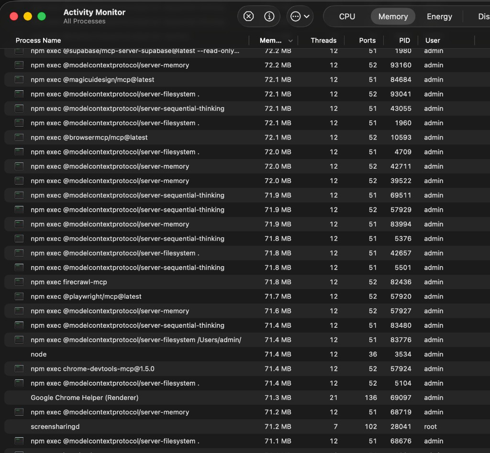

# MCP Sprawl — The Invisible Process Tax

> **Inventory date:** 2026-07-15 (Studio host)  
> **Status:** THE problem Andromeda is solving for MCP alone  
> **Companion:** [ANDROMEDA-SURFACE-AREA.md](./ANDROMEDA-SURFACE-AREA.md) §F → target entity `MCPServerRegistry`  
> **Parallel problem class (out of scope here):** LaunchAgents / cron / watchdogs — see surface-area §G + `LaunchEntity`

---

## 1. Problem statement

Every agent host (Cursor, Claude Code, Codex, Hermes, …) boots its own MCP servers via `npm exec` / `npx` / uv / Python. There is **no shared registry, no dedupe, and no visible roster**. Multiple IDE windows and CLI sessions each spawn another copy of the same package.

Result:

1. **Invisible duplicates** — Activity Monitor fills with identical `npm exec @modelcontextprotocol/server-*` rows; nothing in Andromeda (or any host UI) shows “filesystem is already running ×15”.
2. **Memory tax** — each `npm exec` line shows ~**71 MB** in Activity Monitor (see screenshot). Live Studio snapshot below: **60** `npm exec` parents alone, plus child `node` / Python MCP servers (filesystem / memory / sequential-thinking ×**15** each).
3. **Config sprawl without a SoT** — MCP entries live in `~/.cursor/mcp.json`, Claude Desktop, `~/.claude.json`, Codex `config.toml`, Hermes VM `mcp_servers`, plugin caches, etc. Skills mirror the same pattern across `~/.claude/skills`, `~/.agents/skills`, Hermes, Pi, Gemini, Codex.
4. **We underestimated the count** — early Andromeda surface-area notes (~113 skills / “16 + 19 plugins”) understated both **configured** and **live process** reality. This doc is the corrected evidence.

**Andromeda fix (MCP-focused):** make every MCP server a visible Swift entity under one `MCPServerRegistry` — one roster, process ownership, dedupe policy, no silent duplicates. Skills get a parallel `SkillRegistry` (HAB-39); LaunchAgents stay a separate class (`LaunchEntity`).

---

## 2. Evidence (Activity Monitor)

Screenshot path (repo): `docs/assets/mcp-sprawl-activity-monitor-2026-07-15.png`  
Also mirrored: `~/Developer/Andromeda/docs/assets/mcp-sprawl-activity-monitor-2026-07-15.png`

User-observed pattern in the shot: **filesystem ×7+**, **memory ×6+**, **sequential-thinking ×5+**, plus supabase / magicui / browsermcp / firecrawl / playwright / chrome-devtools / etc., each ~71 MB.

---

## 3. Live process sprawl (Studio, 2026-07-15)

Measured with `ps` on the Studio host (same class of evidence as Activity Monitor; counts drift as windows open/close).

### 3.1 `npm exec` parents by package — **60 total**

| Count | Package |
|------:|---------|
| 15 | `@modelcontextprotocol/server-filesystem` |
| 15 | `@modelcontextprotocol/server-memory` |
| 15 | `@modelcontextprotocol/server-sequential-thinking` |
| 2 | `firecrawl-mcp` |
| 2 | `@magicuidesign/mcp` |
| 2 | `@remotion/mcp` |
| 2 | `@anaisbetts/mcp-installer` (+ youtube) |
| 1 | `@browsermcp/mcp` |
| 1 | `@playwright/mcp` |
| 1 | `chrome-devtools-mcp@1.5.0` |
| 1 | `@supabase/mcp-server-supabase` |
| 1 | `ios-simulator-mcp` |
| 1 | `openai-websearch-mcp` |
| 1 | `xcodebuildmcp` |

### 3.2 Notable child / alternate MCP processes (same session)

| Count | Server |
|------:|--------|
| 15 | `mcp-server-filesystem` (node) |
| 15 | `mcp-server-memory` (node) |
| 15 | `mcp-server-sequential-thinking` (node) |
| 14+ | `pageindex-mcp-server.py` |
| 14+ | `claude-mem` `mcp-server.cjs` (multiple plugin versions) |
| 6 | `qdrant-mcp-server` |
| 2+ | `firecrawl-mcp` / `mcp-server-time` / browsermcp / magicui / supabase |

**Rough combined footprint:** 60 `npm exec` parents + 100+ child MCP-related processes in one snapshot. Parent RSS alone averaged ~6 MB in `ps`; Activity Monitor’s ~71 MB figure matches the larger memory accounting users see in the UI — treat the screenshot as the product-facing tax.

---

## 4. Config inventory (host × tool)

Counts are **actual entries** from configs / `find` / `rg` on 2026-07-15 — not guesses. Skills often symlink across hosts (same skill counted under multiple roots).

| Host / tool | MCP configured | Skills | Sample paths / notes |
|-------------|---------------:|-------:|----------------------|
| **Cursor** | **16** in `mcp.json` + **11** plugin namespaces with `mcp.json` / `.mcp.json` | **113** `~/.claude/skills` entries (many → agents); **112** `~/.agents/skills`; **20** Cursor skill docs; **415** `SKILL.md` under `~/.cursor/plugins` (marketplace cache) | `~/.cursor/mcp.json` — firecrawl, browsermcp, supabase, vercel, postgresql, sequentialthinking, filesystem, memory, magicuidesign, remotion-docs, …; plugins: linear, slack, figma, heygen, vercel, claude-mem, mempalace, fakechat, tavily, magic-patterns, … |
| **Claude Code** | **7** in `~/.claude.json` + **2** in `~/.claude/.mcp.json` + **3** Claude Desktop = **~11 unique** | Same skill roots as Cursor (shared `~/.claude/skills` / `~/.agents/skills`) | MCP: browsermcp, filesystem, memory, sequentialthinking, pageindex-local, qdrant, openaiDeveloperDocs, cerebras-mcp, XcodeBuildMCP, obsidian-mcp-tools, quake-coding-arena |
| **Codex** | **15** unique `[mcp_servers.*]` in `~/.codex/config.toml` | **27** entries in `~/.codex/skills` (**11** `SKILL.md`); **800+** `SKILL.md` under `.tmp`/bundled marketplaces (not “installed product” count) | chrome-devtools, firecrawl, playwright, filesystem, memory, sequentialthinking, qdrant, browsermcp, pageindex-local, stitch, cerebras-*, computer-use, node_repl, openaiDeveloperDocs |
| **Gemini CLI** | **0** `mcpServers` in `~/.gemini/settings.json` | **20** symlinks in `~/.gemini/skills`; **10** extension `SKILL.md` (nano-banana) | Extensions: criticalthink, nano-banana-skills, self-command, persona — MCP SDK present in self-command deps, not registered as servers |
| **Pi** (`~/.pi`) | **0** MCP in `agent/settings.json` | **19** `~/.pi/skills` + **85** `~/.pi/agent/skills` (~**104** `SKILL.md` via `-L`) | Mostly symlinks into `~/.agents/skills` / video pipeline skills; `touchdesigner-mcp` skill folder name only |
| **Hermes local** | **0** discrete `mcp_servers` map; `inherit_mcp_toolsets: true` | **118** skill entries; **97** `SKILL.md` under `skills/` (**182** with `-L`) | `~/.hermes/config.yaml`, `~/.hermes/skills/` — inherits MCP toolsets from parent sessions rather than owning a local server list |
| **Hermes VM (habitat)** | **6** `mcp_servers` + **1** `mcp.servers` | **33** skill entries; **398** `SKILL.md` under `~/.hermes` | `ssh habitat` → `agent-habitat.local` (Tart `agent-habitat` running). MCP keys: higgsfield, agent-zero, gbrain, mempalace, obsidian, wiki (+ agent0_mcp URL). Skills: apple, github, mcp, graphify, pinokio, … |

### 4.1 Cursor `mcp.json` server keys (16)

`enhanced-quake-coding-arena`, `firecrawl`, `browsermcp`, `supabase`, `vercel`, `postgresql`, `openai-websearch`, `sequentialthinking`, `ios-simulator`, `filesystem`, `time`, `memory`, `youtube`, `openaiDeveloperDocs`, `remotion-documentation`, `magicuidesign-mcp`

### 4.2 Habitat SSH

Reachable via `ssh habitat` (hostname `agent-habitat.local`). Inventory above succeeded 2026-07-15. Degrade gracefully when Tart VM is stopped.

---

## 5. Why this is Andromeda’s MCP job

| Today | Target (`MCPServerRegistry`) |
|-------|------------------------------|
| Scattered JSON/TOML/YAML per host | One Swift-visible roster of servers |
| Every window spawns another `npm exec` | Dedupe / shared lifecycle / “already running” |
| Activity Monitor is the only UI | Andromeda console shows count, RSS, owner host, last spawn |
| Skills × MCP counted separately per tool | Cross-host inventory + cloak (don’t leak private MCP env) |

See entity rows in [ANDROMEDA-SURFACE-AREA.md](./ANDROMEDA-SURFACE-AREA.md):

- `catalog.mcp` → `MCPServerRegistry`
- `catalog.skills` → `SkillRegistry`
- Multica follow-on: **HAB-39** (registries) + dedicated sprawl issue (MCP dedupe)

**Explicit:** LaunchAgents / cron / dreamcatcher / Letta KeepAlives are a **parallel** visibility problem (`LaunchEntity`). This document is **MCP-process + MCP-config sprawl only**.

---

## 6. Corrective counts vs earlier underestimate

| Claim (earlier surface-area) | Corrected (this inventory) |
|------------------------------|----------------------------|
| Cursor MCP “16 + 19 plugin folders” | **16** configured + **11** plugin MCP namespaces; **live** duplicates dominate |
| “~113 / ~112 skills” | Still true for Claude/agents roots — **plus** Codex 27, Hermes local 118, habitat 33, Pi ~104, Gemini 30, Cursor plugin cache **415** `SKILL.md` |
| Implicit “MCP is a small catalog” | **60** live `npm exec` parents; filesystem/memory/sequential **×15** each |

---

## 7. Related links

- Surface area: [ANDROMEDA-SURFACE-AREA.md](./ANDROMEDA-SURFACE-AREA.md) §F  
- Project map: [ANIMA-PROJECT-LINKS.md](./ANIMA-PROJECT-LINKS.md)  
- Multica project: `17237130-3eef-4562-89dd-9269caa371ba` (Anima Memory / Andromeda)  
- Linear project: [Anima Memory / Andromeda](https://linear.app/binary-bros/project/anima-memory-andromeda-24f49e6f052c)
