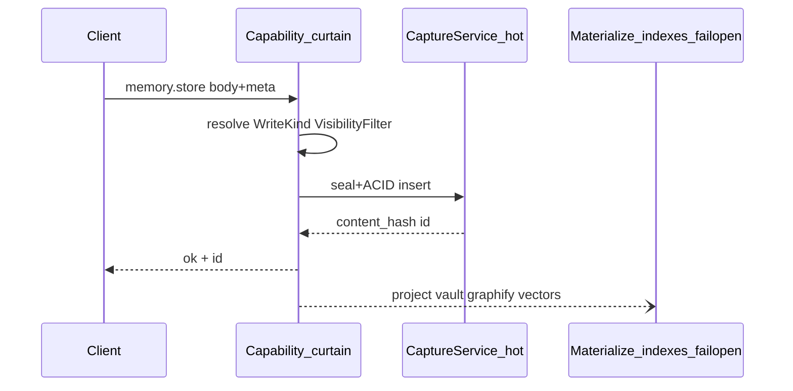
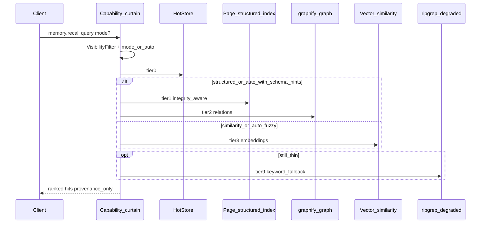

# Memory Curtain Consolidation — one write, one recall

> **Audience:** agents / operators shaping Andromeda Memory (Anima) + Multibrain.  
> **Status:** 🚧 partial (2026-08-08) — Andromida complexity curtain (BIN-246–252) landed in MemoryKit.  
> **Honesty:** ✅ shipped · 🚧 partial · 📐 specified.  
> **Dual-home:** keep this file byte-identical in
> `~/Developer/multibrain/docs/MEMORY-CURTAIN-CONSOLIDATION.md` and
> `~/Developer/Andromeda/docs/MEMORY-CURTAIN-CONSOLIDATION.md`.  
> **Superseding ADR:** [ADR-0017-andromida-complexity-curtain.md](./adr/ADR-0017-andromida-complexity-curtain.md)

Complements [MEMORY-ONEPAGER.md](./MEMORY-ONEPAGER.md) (layers + fleet map) and
[ANDROMEDA-CONTROL-PLANE.md](./ANDROMEDA-CONTROL-PLANE.md) (six pillars). This doc
locks the **client contract** and the **curtain routing** for writes and recall.

---

## 1. Verdict (read this first)

| Decision | Choice |
|----------|--------|
| Canonical agent verbs | **`memory_recall` / `memory_retain` / `memory_forget` / `memory_health`** (BIN-247) |
| Legacy write / recall verbs | **`memory.store` / `memory.recall`** remain **compatibility shims** → retain / recall |
| Journal / session dump | Convenience **aliases** of retain that set `CurtainWriteKind` — **off agent hot path** |
| `infer.write` | Compatibility shim → `CurtainWriteKind.inferAliasDeprecated` |
| Write authority | **JSON outbox** (`JSONOutboxAuthority`) — durable before backend delivery |
| Live projection | **Fail-open** Realm-shaped mirror (`OutboxLiveProjection`); never blocks retain |
| Hot working store | Optional adapter (SwiftData today) — not retain acceptance SoT on the curtain path |
| Retrieval | Intent planner + rank fusion; agents never choose backends |

---

## 2. Client surface — four verbs (+ shims)

Clients (HUD, Home, bar, satellite agents) see a **small** menu:

| Stable ID | Job | Notes |
|-----------|-----|-------|
| `memory_retain` | Persist a memory unit into the JSON outbox | Canonical write |
| `memory_recall` | Fetch relevant memory | Intent plan + fusion |
| `memory_forget` | Tombstone a memory id | Suppresses fused recall |
| `memory_health` | Outbox + projection + drift | Operator / companion |
| `memory.store` / `store` | Shim | → `memory_retain` |
| `memory.recall` / `recall` | Shim | → `memory_recall` |
| `memory.journal` | Alias | → retain + `WriteKind.journal` (off hot path) |
| `memory.session_dump` | Alias | → retain + `WriteKind.sessionDump` (off hot path) |
| `project.state.*` | Unchanged | Tracker fanout stays operator-side |

**Removed from client menus (after shim window):** treating `infer.write` as a first-class memory verb.

**Never on the memory menu:** provider brands, store brands (SwiftData/Realm/Ladybug/Qdrant/graphify/Graphiti), Linear/Multica/n8n, raw API keys.

### Why keep dotted shims

`memory.store` / `memory.recall` are already ✅ in MemoryKit / HUD / Home proofs.
The Andromida standard adds underscore verbs without stranding dogfood strings.
Internally, the curtain speaks retain / recall / forget / health.

---

## 3. WriteKind — behind the curtain

```swift
/// Operator / curtain enum — never exposed as a client capability ID.
public enum WriteKind: String, Sendable, Codable {
    case episodic              // default capture / "we talked"
    case journal               // meditation / morning reflection body
    case sessionDump           // session close dump
    case inferAliasDeprecated  // legacy `infer.write` callers → episodic + tag
    // future:
    // case semanticDeposit    // curated note materialization trigger
    // case photographic       // CLIP/vision shard
}
```

| WriteKind | Client entry | Curtain behavior (target) |
|-----------|--------------|---------------------------|
| `episodic` | `memory.store` | Hot ACID insert + Merkle seal; async materialize fail-open |
| `journal` | `memory.journal` | Same hot path; journal parsing/tags/default body |
| `sessionDump` | `memory.session_dump` | Same hot path; session-dump identity/metadata |
| `inferAliasDeprecated` | legacy `infer.write` only | Map to episodic + provenance tag `infer-write`; **log deprecate**; no LLM call |

**Hard rule:** calling `memory.store` never invokes Cerebras / OpenRouter / Anthropic.
Generation is a different pillar. Today’s buggy name `infer.write` confused “save a
thought” with “run inference.” Fix: retire the name; keep the write.



---

## 4. Write authority — JSON outbox + fail-open live projection

### Honesty today

- ✅ Curtain retain path: `JSONOutboxAuthority` JSONL seeds (MemoryKit).
- ✅ Live projection: `RealmOutboxLiveProjection` (Realm-**shaped**, rebuildable, fail-open).
- 📐 Apple RealmSwift adapter behind `OutboxLiveProjection` — not imported.
- ✅ SwiftData hot store still powers legacy HUD/Home `CaptureService` path; curtain path does not require it for retain acceptance.

### Rejected

| Option | Meaning |
|--------|---------|
| Twin SoTs (SwiftData + Realm both authoritative) | Dual-write hell |
| Realm as write authority | Conflates operator UX with system truth |

```
Client → memory_retain
           ↓
   JSON outbox (authority)  ✅ durable accept
           ↓ fail-open
   Live outbox projection   🚧 Realm-shaped today / RealmSwift later
           ↓ async
   backend fan-out / replay
```

CloudKit remains a **planned cold replica**, not the hot SoT and not proof of hive sync.

---

## 5. Retrieval stack — beyond ripgrep

### Honesty today

`RetrievalService`: SwiftData hot first → optional vault **ripgrep** fallback. Does **not**
query Ladybug, Qdrant, or graphify. Ripgrep is useful degraded search; it is **not** the
long-term semantic spine.

### Target ladder (curtain routes; clients stay on `memory.recall`)

| Tier | Backend (operator) | Answers | Status |
|------|--------------------|---------|--------|
| 0 Hot | SwiftData / future HotStore | Recent episodic, tags, project, visibility | ✅ |
| 1 Page / structured index | PageIndex-style tree + vault schema | “Chapter 3 / this doc section” with integrity | 🚧 / 📐 |
| 2 Graph | graphify `graph.json` (+ Ladybug query later) | “connected to / depends on” | 🚧 fleet; 📐 in recall API |
| 3 Vector similarity | Qdrant / Ladybug vectors | Fuzzy meaning recall | 🚧 fleet; 📐 in recall API |
| 9 Degraded | ripgrep over vault markdown | Keyword last resort | ✅ demote to fallback-only |

**First-class:** graphify + page/structured index. **Demoted:** ripgrep.

### Two recall modes

| Mode | Name | When | Integrity expectations |
|------|------|------|------------------------|
| `structured` | Document / schema parse | Known docs, seals, `content_hash`, frontmatter | Prefer exact + hash-verified |
| `similarity` | Vector / fuzzy | “something like…”, paraphrase, weak keywords | Best-effort; cite provenance |
| `auto` (default) | Curtain picks | Mixed queries | Try structured signals → else similarity → else hot → ripgrep |



Ladybug vs Qdrant roles stay sacred (one job per store): Ladybug = hub graph+vector
index over vault; Qdrant = `/knowledge-sync` fact vectors. Neither brand appears in
client menus. FAISS stays rejected.

---

## 6. Explicit non-goals / anti-confusion

| Claim | Truth |
|-------|-------|
| `infer.write` = LLM | **False today.** It is a memory-store alias. Retire the client ID. |
| Cerebras / Autocache = `memory.store` | **False.** Generation ≠ persist. |
| SwiftData + Realm as twin SoTs | **Rejected.** |
| Realm as write authority | **Rejected** — JSON outbox is authority; Realm-shaped projection is fail-open. |
| Ripgrep vault = semantic memory | **Insufficient** long-term; keep as degraded only. |
| Clients pick Ladybug / Qdrant / graphify / Graphiti | **Never.** Curtain routes. |

LLM proxy pillar keeps separate stable IDs (`write.too`, future `infer.generate` / Autocache
surface). Do **not** recycle `infer.write` for real inference without a versioned
migration that first moves all memory callers onto `memory.store`.

---

## 7. Migration sketch (docs-only; no Realm impl in this pivot)

1. **Docs + HUD menus** — present `memory.store` / `memory.recall`; mark `infer.write` deprecated alias.
2. **CaptureService** — accept `WriteKind` (or map journal/session/infer tags → enum).
3. **RetrievalService** — add mode + stubs/adapters for page index + graphify before vector; keep ripgrep last.
4. **HotStore protocol** — extract when Realm (or other live spine) is chosen; single adapter active.
5. **Shim removal** — drop `infer.write` from HUD parse after callers gone.

No flood of tracker tickets required for this design lock. Optional pointer:
BIN-102 / HAB-105 (or BIN-113 / HAB-119 infer honesty) — one comment max.

---

## 8. Related docs

| Doc | Role |
|-----|------|
| [MEMORY-ONEPAGER.md](./MEMORY-ONEPAGER.md) | Eight layers + Multibrain map |
| [ANDROMEDA-CONTROL-PLANE.md](./ANDROMEDA-CONTROL-PLANE.md) | Six pillars + capability matrix |
| [ANDROMEDA-SURFACE-AREA.md](./ANDROMEDA-SURFACE-AREA.md) | Entity inventory |
| MemoryKit `CaptureService` / `RetrievalService` | As-built hot write + hot→rg recall |

---

*One write. One recall. WriteKind and backends stay behind the curtain.*
