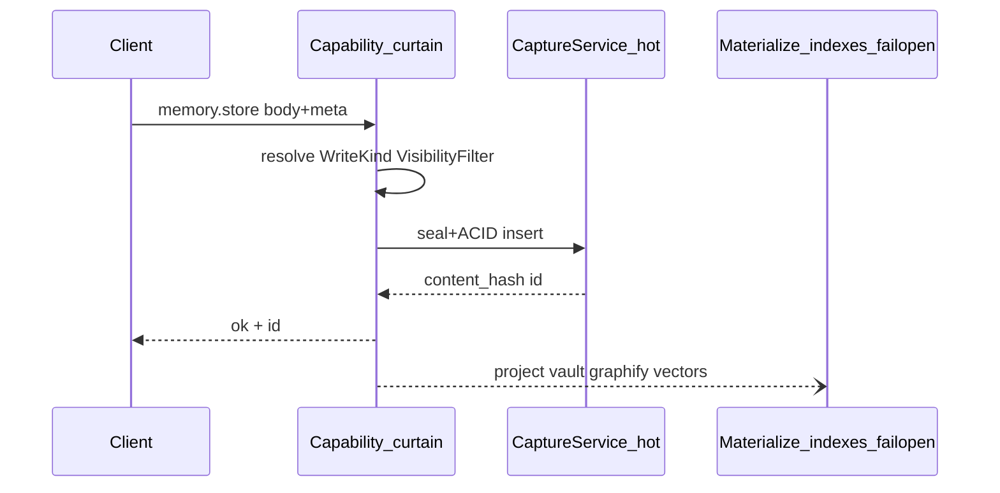
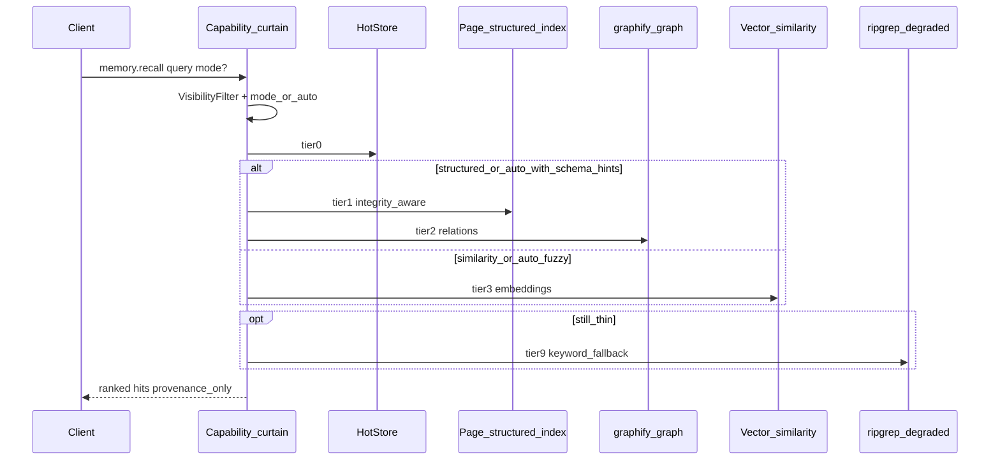

# Memory Curtain Consolidation — one write, one recall

> **Audience:** agents / operators shaping Andromeda Memory (Anima) + Multibrain.  
> **Status:** 📐 design pivot (2026-07-21) — early project; pivot fast. Not a Realm migration plan.  
> **Honesty:** ✅ shipped · 🚧 partial · 📐 specified.  
> **Dual-home:** keep this file byte-identical in
> `~/Developer/multibrain/docs/MEMORY-CURTAIN-CONSOLIDATION.md` and
> `~/Developer/Andromeda/docs/MEMORY-CURTAIN-CONSOLIDATION.md`.

Complements [MEMORY-ONEPAGER.md](./MEMORY-ONEPAGER.md) (layers + fleet map) and
[ANDROMEDA-CONTROL-PLANE.md](./ANDROMEDA-CONTROL-PLANE.md) (six pillars). This doc
locks the **client contract** and the **curtain routing** for writes and recall.

---

## 1. Verdict (read this first)

| Decision | Choice |
|----------|--------|
| Client write verb | **Keep `memory.store`** (already shipped). Do **not** ship a parallel `memory.write` unless a versioned rename is intentional. |
| Client recall verb | **Keep `memory.recall`**. Optional `mode` hint; curtain may auto-pick. |
| Journal / session dump | Convenience **aliases** of `memory.store` that set `WriteKind` — not separate SoTs. |
| `infer.write` | **Retired as a client capability ID.** Compatibility shim → `WriteKind.inferAliasDeprecated`. |
| LLM / Cerebras | **Not a memory write.** Lives under LLM proxy / secrets (`write.too`, Autocache, …). |
| Hot store brands | Clients never see SwiftData or Realm. One hot SoT + optional live fanout adapter. |
| Retrieval | hot → page/structured index → graphify → vector similarity; **ripgrep = degraded fallback only**. |

---

## 2. Client surface — two verbs

Clients (HUD, Home, bar, satellite agents) see a **small** menu:

| Stable ID | Job | Notes |
|-----------|-----|-------|
| `memory.store` | Persist a memory unit | Body + metadata; curtain assigns `WriteKind` |
| `memory.recall` | Fetch relevant memory | Query + optional `mode`; curtain routes backends |
| `memory.journal` | Alias | → `memory.store` + `WriteKind.journal` |
| `memory.session_dump` | Alias | → `memory.store` + `WriteKind.sessionDump` |
| `project.state.*` | Unchanged | Tracker fanout stays operator-side |

**Removed from client menus (after shim window):** `infer.write`.

**Never on the memory menu:** provider brands, store brands (SwiftData/Realm/Ladybug/Qdrant/graphify), Linear/Multica/n8n, raw API keys.

### Why keep `memory.store` (not rename to `memory.write`)

`memory.store` is already ✅ in MemoryKit / HUD / Home proofs. Renaming to `memory.write`
buys little and breaks dogfood strings. Internally, the curtain can still speak
`WriteKind` / “write path.” If a future rename is wanted, do it as a **versioned**
alias (`memory.write` → same CaptureService), not a second confusing peer.

---

## 3. WriteKind — behind the curtain

```swift
/// Operator / curtain enum — never exposed as a client capability ID.
public enum WriteKind: String, Sendable, Codable {
    case episodic              // default capture / "we talked"
    case journal               // meditation / morning reflection body
    case sessionDump           // session close dump
    case inferAliasDeprecated  // legacy `infer.write` callers → episodic + tag
    // future:
    // case semanticDeposit    // curated note materialization trigger
    // case photographic       // CLIP/vision shard
}
```

| WriteKind | Client entry | Curtain behavior (target) |
|-----------|--------------|---------------------------|
| `episodic` | `memory.store` | Hot ACID insert + Merkle seal; async materialize fail-open |
| `journal` | `memory.journal` | Same hot path; journal parsing/tags/default body |
| `sessionDump` | `memory.session_dump` | Same hot path; session-dump identity/metadata |
| `inferAliasDeprecated` | legacy `infer.write` only | Map to episodic + provenance tag `infer-write`; **log deprecate**; no LLM call |

**Hard rule:** calling `memory.store` never invokes Cerebras / OpenRouter / Anthropic.
Generation is a different pillar. Today’s buggy name `infer.write` confused “save a
thought” with “run inference.” Fix: retire the name; keep the write.



---

## 4. Hot store strategy — SwiftData today → Realm spine (one SoT)

### Honesty today

- ✅ Hot episodic SoT: SwiftData at `~/.multibrain/anima-hot.store` via `CaptureService`.
- 📐 Realm: **not implemented**. Do not claim dual-write.

### Honest reading of “SwiftData in Realm”

Apple does **not** run SwiftData *inside* Realm. Practical pivot options:

| Option | Meaning | Prefer when |
|--------|---------|-------------|
| **A. Realm as sync/realtime spine** | Realm (or Device Sync / equivalent) owns multi-device live fanout; Swift types / Codable models stay the app schema; optional SwiftData kept local-only short-term | Need live multi-device without iCloud quota as the assumption |
| **B. One hot adapter** | `HotStore` protocol; SwiftDataAdapter today, RealmAdapter later; **one** active backend per host | Cleanest curtain; recommended migration shape |
| **C. Two peer SoTs** | SwiftData + Realm both authoritative | **Rejected** — dual-write hell |

**Locked preference:** **B**, with **A** as the sync story once Realm (or similar) is chosen.
Clients never see either brand. Local ACID remains mandatory; live fanout is **optional**
and must not assume iCloud/CloudKit quota.

```
Client → memory.store
           ↓
     HotStore protocol
           ↓
   ┌───────┴────────┐
   │ SwiftData ✅   │  today
   │ Realm adapter  │  📐 later (realtime / multi-device)
   └────────────────┘
           ↓
   async project → vault / page index / graphify / vectors
```

CloudKit remains a **planned cold replica**, not the hot SoT and not proof of hive sync.

---

## 5. Retrieval stack — beyond ripgrep

### Honesty today

`RetrievalService`: SwiftData hot first → optional vault **ripgrep** fallback. Does **not**
query Ladybug, Qdrant, or graphify. Ripgrep is useful degraded search; it is **not** the
long-term semantic spine.

### Target ladder (curtain routes; clients stay on `memory.recall`)

| Tier | Backend (operator) | Answers | Status |
|------|--------------------|---------|--------|
| 0 Hot | SwiftData / future HotStore | Recent episodic, tags, project, visibility | ✅ |
| 1 Page / structured index | PageIndex-style tree + vault schema | “Chapter 3 / this doc section” with integrity | 🚧 / 📐 |
| 2 Graph | graphify `graph.json` (+ Ladybug query later) | “connected to / depends on” | 🚧 fleet; 📐 in recall API |
| 3 Vector similarity | Qdrant / Ladybug vectors | Fuzzy meaning recall | 🚧 fleet; 📐 in recall API |
| 9 Degraded | ripgrep over vault markdown | Keyword last resort | ✅ demote to fallback-only |

**First-class:** graphify + page/structured index. **Demoted:** ripgrep.

### Two recall modes

| Mode | Name | When | Integrity expectations |
|------|------|------|------------------------|
| `structured` | Document / schema parse | Known docs, seals, `content_hash`, frontmatter | Prefer exact + hash-verified |
| `similarity` | Vector / fuzzy | “something like…”, paraphrase, weak keywords | Best-effort; cite provenance |
| `auto` (default) | Curtain picks | Mixed queries | Try structured signals → else similarity → else hot → ripgrep |



Ladybug vs Qdrant roles stay sacred (one job per store): Ladybug = hub graph+vector
index over vault; Qdrant = `/knowledge-sync` fact vectors. Neither brand appears in
client menus. FAISS stays rejected.

---

## 6. Explicit non-goals / anti-confusion

| Claim | Truth |
|-------|-------|
| `infer.write` = LLM | **False today.** It is a memory-store alias. Retire the client ID. |
| Cerebras / Autocache = `memory.store` | **False.** Generation ≠ persist. |
| SwiftData + Realm as twin SoTs | **Rejected.** |
| Ripgrep vault = semantic memory | **Insufficient** long-term; keep as degraded only. |
| Clients pick Ladybug / Qdrant / graphify | **Never.** Curtain routes. |

LLM proxy pillar keeps separate stable IDs (`write.too`, future `infer.generate` / Autocache
surface). Do **not** recycle `infer.write` for real inference without a versioned
migration that first moves all memory callers onto `memory.store`.

---

## 7. Migration sketch (docs-only; no Realm impl in this pivot)

1. **Docs + HUD menus** — present `memory.store` / `memory.recall`; mark `infer.write` deprecated alias.
2. **CaptureService** — accept `WriteKind` (or map journal/session/infer tags → enum).
3. **RetrievalService** — add mode + stubs/adapters for page index + graphify before vector; keep ripgrep last.
4. **HotStore protocol** — extract when Realm (or other live spine) is chosen; single adapter active.
5. **Shim removal** — drop `infer.write` from HUD parse after callers gone.

No flood of tracker tickets required for this design lock. Optional pointer:
BIN-102 / HAB-105 (or BIN-113 / HAB-119 infer honesty) — one comment max.

---

## 8. Related docs

| Doc | Role |
|-----|------|
| [MEMORY-ONEPAGER.md](./MEMORY-ONEPAGER.md) | Eight layers + Multibrain map |
| [ANDROMEDA-CONTROL-PLANE.md](./ANDROMEDA-CONTROL-PLANE.md) | Six pillars + capability matrix |
| [ANDROMEDA-SURFACE-AREA.md](./ANDROMEDA-SURFACE-AREA.md) | Entity inventory |
| MemoryKit `CaptureService` / `RetrievalService` | As-built hot write + hot→rg recall |

---

*One write. One recall. WriteKind and backends stay behind the curtain.*
