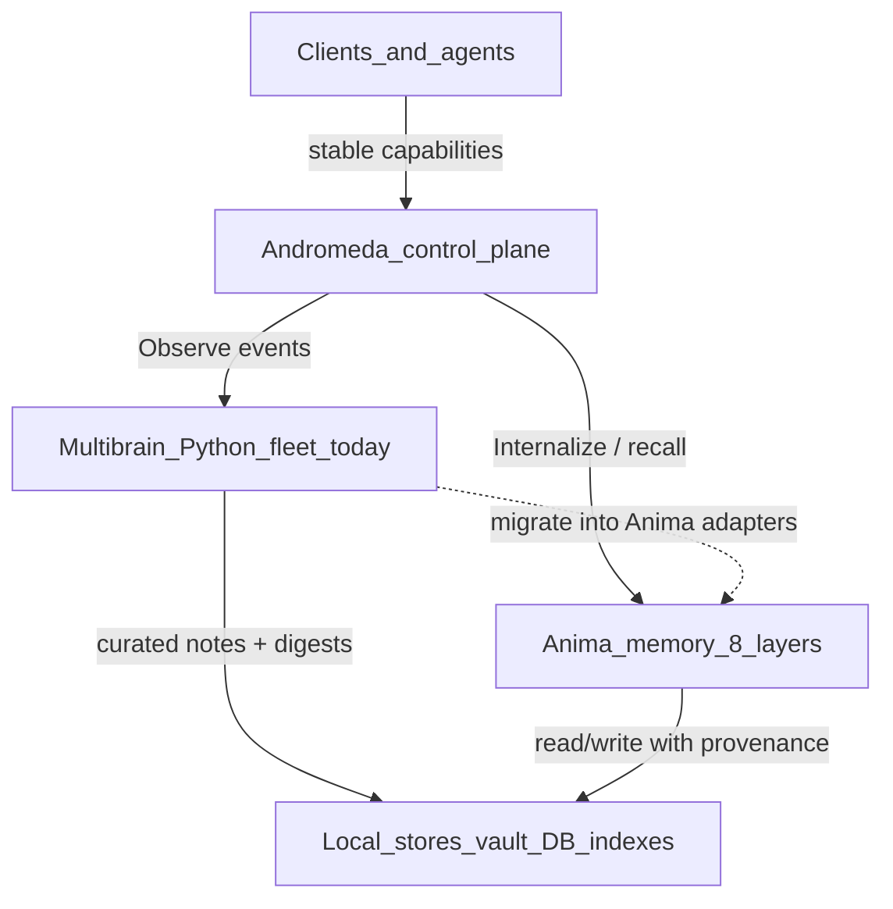
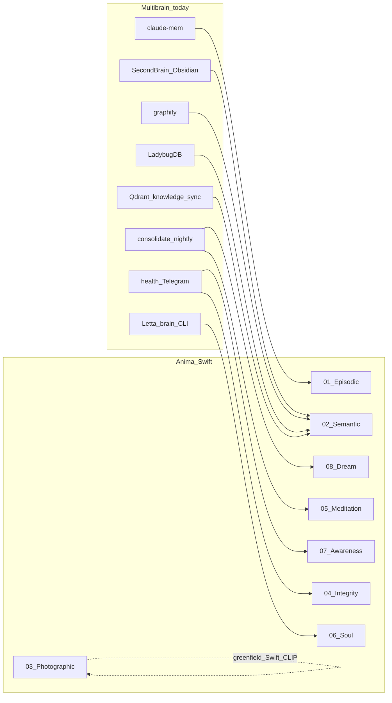
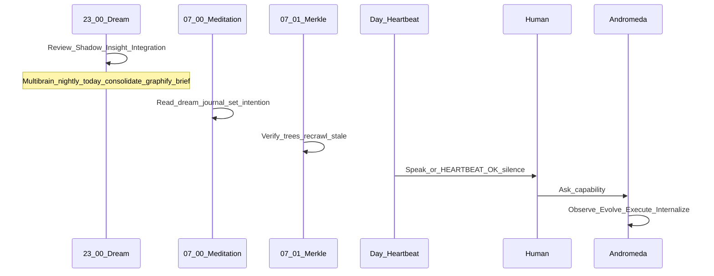

# Memory One-Pager — Andromeda × Anima × Multibrain

> **Audience:** any agent drafting Anima (Swift memory layer) inside Andromeda (Swift control plane).  
> **Rule:** one job per store. Do not invent a ninth silo.

---

## 1. The stack in one sentence

**Andromeda** is the local-first Swift control plane (Observe → Evolve → Execute → Internalize).  
**Anima** is Andromeda’s memory subsystem — eight layers of remembering, all on-device.  
**Multibrain** is today’s working Python capture/curation fleet that Anima must **consume and eventually subsume**, not ignore or duplicate.



---

## 2. Andromeda loop ↔ memory moments

| Andromeda phase | Memory job | Multibrain today | Anima target |
|-----------------|------------|------------------|--------------|
| **Observe** | Record events before processing; provenance | claude-mem, Hermes, Multica extractors | Episodic + Integrity seal |
| **Evolve** | Distill, link, decide what matters | `consolidate.py`, graphify, Daily Brief | Dream + Meditation + Semantic |
| **Execute** | Act with stable capabilities | Letta/`brain`, tools, Telegram alerts | Soul + Awareness (when to speak) + Gateway |
| **Internalize** | Write durable learnings back | `/checkpoint` → `/knowledge-sync` → vault/Qdrant/memory.md | All layers + Merkle verify |

Andromeda principles that Anima must never violate:

- No silent loss, hidden automation, or invisible watchdogs  
- Durable record **before** processing; replay/rollback possible  
- Permissions + visible console/telemetry/health  
- Local-first — zero cloud dependency for memory storage

---

## 3. Anima’s eight layers ↔ existing machinery

| # | Anima layer | Intent | Maps from (multibrain / fleet) | Do **not** reinvent as |
|---|-------------|--------|--------------------------------|-------------------------|
| 01 | **Episodic** | “We talked Tuesday” — timed, emotional, compactable | `claude-mem` observations + session transcripts | Another raw chat dump without compaction |
| 02 | **Semantic** | “Chapter 3 has the state machine” — structure-first recall | Obsidian SecondBrain + PageIndex-style crawl; graphify communities | Blind vector-only RAG over the whole vault |
| 03 | **Photographic** | “I’ve seen that diagram” — CLIP / MLX | (gap today — screenshots not first-class) | Cloud vision APIs |
| 04 | **Integrity** | “Can I trust this memory?” — Merkle | health.json + git vault + content-hash dedup ledger | Trust-by-default indexes |
| 05 | **Subconscious / Meditation** | Morning reflection from dream journal | Daily Brief + weekly retro scripts | Another cron that only logs |
| 06 | **Soul** | Presence, mood, relationship depth | Letta `rolling_state` / persona (thin today) | Generic chatbot personality paste |
| 07 | **Awareness / Heartbeat** | Speak only when it matters (`HEARTBEAT_OK` = silence) | hourly health + Telegram (too loud / not presence-aware) | Always-on nag bots |
| 08 | **Dream** | Night: Review → Shadow → Insight → Integration | nightly `run-nightly.sh` + graphify surprise edges | Letta owning the batch loop (it doesn’t today) |



### Store split (sacred — do not conflate)

| Store | Role | Owner tomorrow |
|-------|------|----------------|
| **SwiftData or Realm (Local)** | Hot episodic capture (SoT for raw capture, transactional, sub-ms, local, main-thread non-blocking, returns immediately after write + seal) | Anima core capture, Layer 01 (Episodic) |
| **iCloud / CloudKit** | Cold sync (DR backup + automatic multi-device satellite sync, one-way from local hot store) | Anima core sync |
| **Obsidian / SecondBrain** | Human-readable substrate (SoT for curated semantic notes) | Semantic + Dream outputs, Layer 02 (Semantic) |
| **LadybugDB** | Multibrain hub graph+vector index (rebuildable cache, point ID = `content_hash`, thin payload, async-at-materialization, fail-open) | Semantic retrieval backend (or Swift HNSW/USearch peer) |
| **Qdrant `secondbrain_learnings`** | `/knowledge-sync` fact vectors only (rebuildable cache, point ID = `content_hash`, thin payload, async, fail-open) | Semantic adapter — **not** the nightly index |
| **claude-mem SQLite/Chroma** | Legacy capture river (ingested by materializer, never written by Swift) | Episodic Ingest Source |
| **FAISS** | Rejected | Stay rejected |
| **Merkle / Integrity** | Trust proofs over memory trees | New Anima core |

---

## 4. Day-in-the-life (aligned clocks)



| Clock | Anima | Multibrain today (Studio) |
|-------|-------|---------------------------|
| ~02:30 / 03:00 | Dream batch | `com.multibrain.nightly` |
| ~07:00 | Meditation | Daily Brief already on disk |
| Hourly | Awareness pulse | `com.multibrain.health` → Telegram on RED |
| Mon 08:00 | Integration / retro | `weekly_retro` (Studio) |
| On demand | Conversation | `brain` → Letta |

Book = Phase-1 satellite (nightly+health only). Anima agents must not assume Letta/Ladybug on every Mac.

---

## 5. What to tell the Anima agent (paste-ready brief)

```text
You are drafting Anima — the Swift-native memory layer for Andromeda.

ANDROMEDA (parent product)
- Local-first Swift control plane for agents, models, tools, memory, graphs, workflows.
- Stable client capabilities; hide provider churn.
- Core loop: Observe → Evolve → Execute → Internalize.
- Hard rules: durable events before processing; provenance; permissions; replay/rollback;
  everything visible in a native macOS console (no silent watchdogs).

ANIMA (your scope)
- Eight memory layers (Episodic, Semantic, Photographic, Integrity, Meditation, Soul,
  Awareness, Dream). Swift actors, Apple Silicon, MLX/CLIP, local DBs — 0 cloud deps for storage.
- Philosophy: remember = understand again through who we’ve become; silence is a feature
  (HEARTBEAT_OK); morning meditation; night dream cycle (Review→Shadow→Insight→Integration).

MULTIBRAIN (existing production — do not ignore)
- Python fleet on Studio hub + Book satellite. Read:
  ~/Developer/multibrain/docs/MEMORY-ONEPAGER.md  (this doc)
  ~/Developer/multibrain/docs/ARCHITECTURE.md
  ~/Developer/multibrain/docs/KNOWLEDGE-STACK.md
  ~/Developer/multibrain/docs/FLEET.md
  ~/Developer/multibrain/docs/DATA-CONTRACTS.md
- Nightly conductor is consolidate.py — NOT Letta. Letta is interactive Librarian only.
- LadybugDB = hub index. Qdrant = knowledge-sync only. FAISS = rejected.
- Ritual: /checkpoint → /knowledge-sync → /close. Vault truth = ~/Developer/SecondBrain.

YOUR DESIGN MANDATES
1. Swift-first APIs that Andromeda can call as capabilities (recall, dream, heartbeat, seal).
2. Adapters over existing stores first (claude-mem, Obsidian, Ladybug/Qdrant, health.json) —
   migrate inward; don’t strand the fleet.
3. One job per store — never merge Qdrant and LadybugDB roles.
4. Integrity (Merkle) wraps writes; health/alerts stay loud and visible to Andromeda console.
5. Awareness must support HEARTBEAT_OK (silence) — improve on today’s always-Telegram-on-RED.
6. Photographic (CLIP) is greenfield — ship local-only.
7. Dream replaces/absorbs nightly curation over time; until then, coexist with launchd nightly.
8. Output: architecture + Swift module map + adapter interfaces + migration phases —
   not a rewrite manifesto that deletes working capture.

NON-GOALS
- Cloud memory SaaS
- Replacing claude-mem capture on day one
- Building Andromeda’s full agent scheduler (that’s Andromeda’s job; you Internalize for it)
```

---

## 6. Suggested Swift module → Andromeda capability surface

**Capability hiding (locked 2026-07-15):** clients and satellite agents call stable capability IDs only. Andromeda Observe→Evolve→Execute→Internalize selects providers behind the curtain — same pattern as inference. Never expose Linear/Multica routing, model registries, n8n, or store plumbing in client tool menus.

| Client-facing capability (Swift) | Hides behind the curtain |
|----------------------------------|--------------------------|
| `memory.recall` / `memory.store` / `memory.journal` / `memory.document` | SwiftData, CloudKit, Obsidian materialize, Qdrant/Ladybug, claude-mem |
| `infer.write` (or similar) | Cerebras, model registry, health, OpenRouter fallbacks, MCP server logic, n8n |
| `project.state` CRUD (`list` / `get` / `create` / `update`) | Linear + Multica + kanban + Slack fanout |

| Anima module | Andromeda capability ID (sketch) | Side effects |
|--------------|----------------------------------|--------------|
| `AnimaHotStore` (SwiftData/Realm) | `memory.store` / `memory.recall` (also `memory.episodic.*`) | SwiftData/Realm local |
| `Knowledge/` PageIndex | `memory.document` / `memory.semantic.search` | Read vault; optional index rebuild |
| `VisionEngine` | `memory.photographic.search` | CLIP/MLX local |
| `MerkleTree` | `memory.integrity.verify` | Proofs; fail closed |
| `Meditation` | `memory.journal` / `memory.meditation.run` | Journal write |
| `Soul` | `memory.soul.context` | Mood/relationship context only |
| `HeartbeatEngine` | `memory.awareness.pulse` | May notify or return `HEARTBEAT_OK` |
| `Anima` dream | `memory.dream.run` | Nightly batch; visible job in console |
| (Andromeda PM fabric) | `project.state.list/get/create/update` | Linear∪Multica∪Slack — **never** exposed as those brands to clients |
| (Andromeda inference) | `infer.write` | Provider registry + health + fallbacks — **never** Cerebras/OpenRouter IDs on the client menu |

Every capability: observe-event first → execute → internalize with provenance hash. n8n may orchestrate behind capabilities; never treat n8n as the client SoT.

---

## 7. Related docs

| Doc | Use |
|-----|-----|
| [ARCHITECTURE.md](ARCHITECTURE.md) | Multibrain layers as-built |
| [KNOWLEDGE-STACK.md](KNOWLEDGE-STACK.md) | Checkpoint / sync / close |
| [FLEET.md](FLEET.md) | Studio hub vs Book satellite |
| [RUNBOOK.md](RUNBOOK.md) | LaunchAgents, Telegram, health |
| [DATA-CONTRACTS.md](DATA-CONTRACTS.md) | Note + health schemas |
| [MANIFESTO.md](../MANIFESTO.md) | Why we fight evaporation tax |

---

*One page. Many brains. One remembering.*
