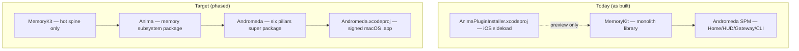

# Swift Package Hierarchy — MemoryKit → Anima → Andromeda

> **Audience:** agents building Andromeda/Anima Swift.  
> **Status:** 📐 target architecture (2026-07-21) — honest about what ships today.  
> **Dual-home:** keep byte-identical in `~/Developer/multibrain/docs/` and `~/Developer/Andromeda/docs/`.  
> **Trackers:** BIN-151 (epic) · HAB-142 · sub-issues BIN-152…154.

---

## 1. Executive answer

| Question | Answer |
|----------|--------|
| Do we have an Andromeda super package? | **Yes** — `~/Developer/Andromeda/Package.swift` (SPM). |
| Do we have a separate **Anima** package? | **Not yet** — Anima is the product name for memory; code lives in **MemoryKit** today. |
| Do we have a top-level **Andromeda Xcode app**? | **Not yet** — macOS ships as SPM **executables** (`swift run AndromedaHUD`). No signed `.app` bundle. |
| What is AnimaPluginInstaller? | **iOS sideload preview** — vault plugin installer + Personal OS bus demo. Duplicates preview code; **BIN-150** flips it to depend on MemoryKit/Anima. |

**Build order (bottom → top):** MemoryKit spine → Anima memory package → Andromeda control plane → Andromeda.app (Xcode).

---

## 2. Today vs target



---

## 3. Target `Package.swift` tree

```
Andromeda/                          ← repo root
├── Package.swift                   ← super package (exists ✅)
├── Andromeda.xcodeproj             ← 📐 Phase 3 — signed macOS app shell
├── Packages/
│   ├── MemoryKit/                  ← exists ✅ — shrinks to hot spine
│   │   ├── Package.swift
│   │   └── Sources/MemoryKit/
│   │       ├── Storage/            SwiftDataContainer, HotStore protocol
│   │       ├── Models/             AnimaEpisodicRecord
│   │       ├── Crypto/             AnimaSeal, MerkleTree
│   │       ├── Services/           CaptureService, RetrievalService (facade)
│   │       ├── Security/           VisibilityFilter
│   │       └── Curtain/            WriteKind, CapabilityRouter (📐)
│   │
│   └── Anima/                      ← 📐 Phase 1 — new middle package
│       ├── Package.swift
│       └── Sources/
│           ├── AnimaCore/          Memory domain types shared across layers
│           ├── AnimaKnowledge/     PageIndex, ObsidianMaterializer
│           ├── AnimaIndexing/      QdrantIndexer, LadybugIndexer adapters
│           ├── AnimaSync/          CloudKitSyncEngine, Realm fanout adapter (📐)
│           ├── AnimaPersonalOS/    capability DTOs + clients (BIN-144)
│           ├── AnimaDream/         nightly consolidation host (📐)
│           └── AnimaSoul/          librarian context, meditation (📐)
│
├── Sources/
│   ├── AndromedaCore/              config, Observe→Internalize spine
│   ├── AndromedaAutoCache/         LLM proxy pillar
│   ├── AndromedaGateway/           Hummingbird gateway
│   ├── AndromedaHomeCore/          depends: Anima (+ MemoryKit during transition)
│   ├── AndromedaHUDCore/           depends: Anima (+ MemoryKit during transition)
│   ├── AndromedaFleet/             📐 LaunchEntity, FleetObserve (from MemoryKit)
│   ├── AndromedaMCP/               📐 MCPServerRegistry host (from MemoryKit)
│   ├── AndromedaHome/              executable
│   ├── AndromedaHUD/               executable
│   └── AndromedaCLI/               executable
│
multibrain/
├── Packages/MemoryKit/             ← dual-home mirror (pin SHA with Andromeda)
└── apps/AnimaPluginInstaller/      ← iOS sideload (only first-party .xcodeproj today)
    ├── AnimaPluginInstaller.xcodeproj
    └── Package.swift fragment      ← 📐 becomes path dep on Anima (BIN-150)
```

---

## 4. Dependency direction (hard rule)

```
MemoryKit  →  Anima  →  AndromedaHomeCore / AndromedaHUDCore  →  executables
                ↑
         never imports Andromeda
MemoryKit never imports Anima (Anima wraps/enriches MemoryKit spine)
```

During **transition shim** (one release): `AndromedaHomeCore` may import both `MemoryKit` and `Anima` while modules move. Remove `MemoryKit` from app targets when Anima re-exports the stable curtain surface.

---

## 5. Module migration map (from today's MemoryKit monolith)

| Current path (`MemoryKit/Sources/`) | Target home | Phase |
|-------------------------------------|-------------|-------|
| `Storage/`, `Models/`, `Crypto/`, `Services/`, `Security/` | **MemoryKit** (stay) | — |
| `Workers/ObsidianMaterializer.swift` | **AnimaKnowledge** | 1 |
| `Indexing/QdrantIndexer.swift`, `LadybugIndexer.swift` | **AnimaIndexing** | 1 |
| `Sync/CloudKitSyncEngine.swift`, `SyncConfig.swift` | **AnimaSync** | 2 |
| `TCA/MemoryReducer.swift` | **AnimaCore** or app targets | 1 |
| `Registry/*`, `Telemetry/*` | **AndromedaFleet** / **AndromedaMCP** | 2 |
| `ProjectState/*` | **AndromedaCore** (operator bridge) | 2 |
| `UI/*` (CommandCenter, MCPRegistry, …) | **AndromedaHomeCore** / HUD | 2 |

**Personal OS preview** (Realm, EventKit, Live Activity in AnimaPluginInstaller) → **AnimaPersonalOS** module (BIN-144), then BIN-150 removes duplicated preview code from the iOS app.

---

## 6. Target `Packages/Anima/Package.swift` (sketch)

```swift
// swift-tools-version: 6.1
import PackageDescription

let package = Package(
    name: "Anima",
    platforms: [.macOS(.v14), .iOS(.v17)],
    products: [
        .library(name: "AnimaCore", targets: ["AnimaCore"]),
        .library(name: "AnimaKnowledge", targets: ["AnimaKnowledge"]),
        .library(name: "AnimaIndexing", targets: ["AnimaIndexing"]),
        .library(name: "AnimaSync", targets: ["AnimaSync"]),
        .library(name: "AnimaPersonalOS", targets: ["AnimaPersonalOS"]),
    ],
    dependencies: [
        .package(path: "../MemoryKit"),
    ],
    targets: [
        .target(name: "AnimaCore", dependencies: [
            .product(name: "MemoryKit", package: "MemoryKit"),
        ]),
        .target(name: "AnimaKnowledge", dependencies: ["AnimaCore"]),
        .target(name: "AnimaIndexing", dependencies: ["AnimaCore"]),
        .target(name: "AnimaSync", dependencies: ["AnimaCore"]),
        .target(name: "AnimaPersonalOS", dependencies: ["AnimaCore"]),
        .testTarget(name: "AnimaTests", dependencies: ["AnimaCore"]),
    ]
)
```

Clients still call **`memory.store` / `memory.recall`** — never `AnimaKnowledge` brands. Anima implements the curtain; MemoryKit owns the hot transactional spine.

---

## 7. Target root `Package.swift` delta (sketch)

```swift
dependencies: [
    .package(path: "Packages/MemoryKit"),
    .package(path: "Packages/Anima"),          // 📐 Phase 1
    // ... hummingbird, snapshot-testing, etc.
],
targets: [
    .target(name: "AndromedaHUDCore", dependencies: [
        .product(name: "AnimaCore", package: "Anima"),  // replaces direct MemoryKit
    ]),
    // AndromedaFleet ← Registry + Telemetry (moved out of MemoryKit)
]
```

---

## 8. Andromeda.xcodeproj (Phase 3 — BIN-153)

| Need | Why SPM executables aren't enough |
|------|-----------------------------------|
| Signed `.app` bundle | CloudKit entitlements, App Store path, user-facing install |
| `Info.plist` + icons | BIN-112 brand assets on real app target |
| Universal links / Shortcuts | BIN-141 App Intents host |
| iOS companion | Future Andromeda iOS shell (Personal OS host — BIN-147) |

**Not blocking** HUD dogfood today — `swift run AndromedaHUD` + LaunchAgent is the current path (PROOF 43 honesty).

---

## 9. Phased rollout

| Phase | Deliverable | Tracker | Blocks |
|-------|-------------|---------|--------|
| **0** | This doc + curtain consolidation | BIN-151 / HAB-142 | — |
| **1** | `Packages/Anima` with Knowledge + Indexing extraction | BIN-152 | PR #10 merge helpful |
| **2** | Move Registry/Telemetry/ProjectState → Andromeda | BIN-154 | Phase 1 |
| **3** | `Andromeda.xcodeproj` macOS app target | BIN-153 | BIN-101 install + BIN-79 CloudKit |
| **4** | AnimaPluginInstaller → Anima path dep | BIN-150 | BIN-144 PersonalOS module |

---

## 10. Related docs

| Doc | Role |
|-----|------|
| [MEMORY-CURTAIN-CONSOLIDATION.md](./MEMORY-CURTAIN-CONSOLIDATION.md) | Client contract (one write / one recall) |
| [MEMORY-ONEPAGER.md](./MEMORY-ONEPAGER.md) | Anima layers + capability sketch |
| [ANDROMEDA-CONTROL-PLANE.md](./ANDROMEDA-CONTROL-PLANE.md) | Six pillars |
| [WORKSTREAM-CONSOLIDATION-2026-07-21.md](./WORKSTREAM-CONSOLIDATION-2026-07-21.md) | Branch/PR map |
| [ANDROMEDA-WORKSPACE-READINESS.md](./ANDROMEDA-WORKSPACE-READINESS.md) | Flip gates |

---

*MemoryKit is the spine. Anima is the memory heart. Andromeda is the control plane. The Xcode app is the body.*
