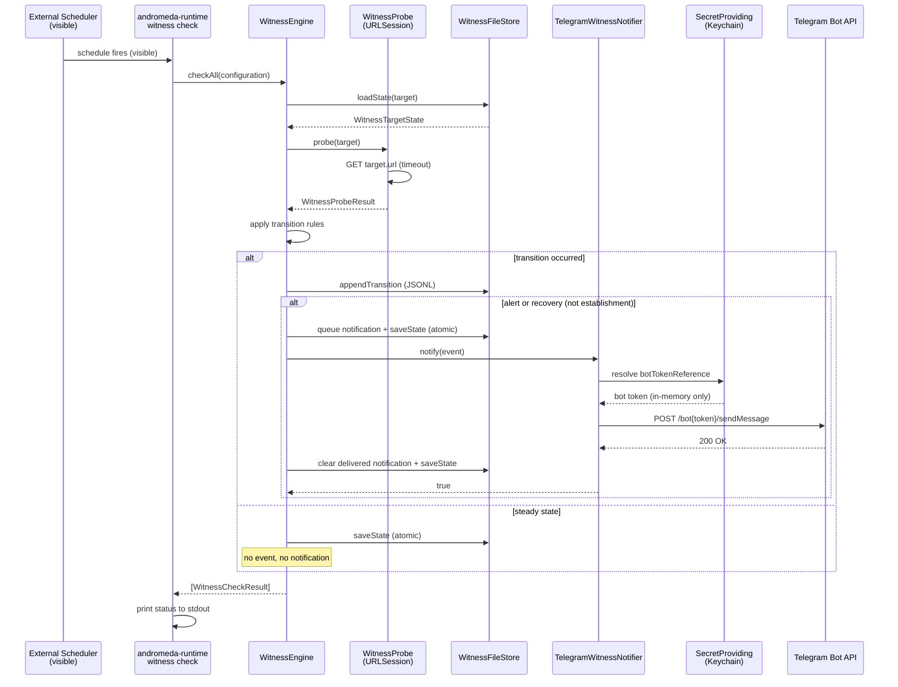

# ADR-0018 — External Fleet Witness (Swift-first Mini → Studio probe)

> **Status:** Proposed (2026-08-17)
> **Honesty:** 🚧 implemented on a feature branch, not merged or deployed. No launchd plist installed.

## Context

On Aug 17, a WindowServer session collapse on Studio left the Mini unable to
determine whether Studio's runtime was alive. The Mini had no external
observer — it could not distinguish "Studio is down" from "Studio is
degraded" from "my own network is broken." The incident motivated a
**typed Swift-first external witness** that the Mini can run to probe
Studio's HTTP health endpoints and alert on transitions.

The witness is deliberately **external**: it runs on the Mini, probes
Studio over the network (LAN / Tailscale), and records durable state. It
does not run on Studio itself — a local watchdog cannot detect its own
host's collapse.

### Scope separation

| Concern | Owner | Where |
|---------|-------|-------|
| External probe of Studio from Mini | This ADR — `AndromedaHostOps` | `WitnessEngine` |
| Local repair of Studio (restart, repair) | Studio local tooling (separate) | Not this ADR |
| Scheduling (when to probe) | External, visible | `cron`, `andromeda-runtime witness check` |

The witness does **not** repair Studio. It observes and alerts. Local
repair on Studio is a separate concern with its own visibility requirements.

Letta and Osaurus are not GUI-only dependencies. Their verified stable CLI
surfaces are the correct local-repair targets:

- `/Applications/Letta.app/Contents/MacOS/letta server --env-name studio.local --debug`
- `/opt/homebrew/bin/osaurus serve --supervise --interval 15`

Their menu-bar/Desktop apps may remain login items, but service continuity
must supervise these headless commands independently of WindowServer.

## Decision

### 1. Operational code in AndromedaHostOps, not MemoryKit

All witness types live in `AndromedaHostOps`:
`WitnessModels`, `WitnessProbe`, `WitnessStore`, `WitnessNotifier`,
`WitnessEngine`. MemoryKit remains a data/memory package — fleet
observability is host-ops, not memory.

### 2. Typed models and config

- `WitnessConfiguration` — owner, host, targets, failure threshold, state
  directory, optional Telegram config. Codable, no secrets.
- `WitnessTarget` — label, URL, timeout, success status range.
- `WitnessHealthStatus` — `unknown | healthy | failed`.
- `WitnessTargetState` — durable per-target state with counters.
- `WitnessTransitionEvent` — typed transition with kind, reason, timestamps.

### 3. Injectable probe with correct HTTP classification

`WitnessProbing` protocol with `WitnessProbe` (URLSession) and
`RecordedWitnessProbe` (test mock). Classification:

| Outcome | Condition |
|---------|-----------|
| `success(statusCode)` | HTTP response with status in configured range |
| `httpError(statusCode)` | HTTP response with status outside range |
| `timeout` | `URLError.timedOut` |
| `connectionFailure` | DNS, refused, TLS, or other transport error |

Payloads are **not** inspected — only status codes and transport errors.
This avoids overfitting to response bodies that may change.

### 4. Durable atomic state + append-only JSONL log

- Per-target state: `<label>.state.json` — atomic write (`.atomic` option).
- Per-target transitions: `<label>.transitions.jsonl` — append-only.
- Missing state file → fresh initial state (not an error).
- Corrupt state file → throws `WitnessStoreError` (surfaces, never silent).
- Label mismatch → throws (prevents cross-target state corruption).

### 5. Consecutive failure threshold (default 3)

- `unknown → failed`: only after `failureThreshold` consecutive failures.
- `healthy → failed`: only after `failureThreshold` consecutive failures.
- A single success resets `consecutiveFailures` to 0.

### 6. Transition-only events and notifications

| From | Probe result | Failures | To | Event | Notify |
|------|-------------|----------|-----|-------|--------|
| unknown | success | 0 | healthy | `established` | **no** |
| unknown | failure | < threshold | unknown | none | no |
| unknown | failure | ≥ threshold | failed | `alert` | **yes** |
| healthy | success | 0 | healthy | none | no |
| healthy | failure | < threshold | healthy | none | no |
| healthy | failure | ≥ threshold | failed | `alert` | **yes** |
| failed | success | 0 | healthy | `recovery` | **yes** |
| failed | failure | any | failed | none | no |

**Initial `unknown → healthy` establishes state without a recovery
notification** — there is nothing to recover from. **`unknown → failed`
alerts only after the threshold** — a single transient failure does not
fire. Steady-state probes (same status) never produce events.

### 7. Notification protocol + adapters

- `WitnessNotifying` protocol.
- `NoOpWitnessNotifier` — no channel configured.
- `RecordingWitnessNotifier` — test capture.
- `TelegramWitnessNotifier` — resolves bot token via `SecretProviding` /
  `SecretReference` (Keychain in production). Chat ID from config/CLI.
  `TelegramHTTPClient` protocol makes HTTP calls injectable — no real
  network in tests. Token is never stored in config, state, or JSONL log.

### 8. CLI: `andromeda-runtime witness`

```
andromeda-runtime witness check    [--config path] [--owner name] [--host name]
andromeda-runtime witness status   [--config path] [--owner name] [--host name]
andromeda-runtime witness log      [--config path] [--limit N] [--target label]
```

- `check` — single probe cycle (no hidden loop). Schedule externally.
- `status` — reads durable state, shows owner/host/last check/counters/reasons.
- `log` — reads JSONL transition log.

**No long-running hidden loop in product code.** Scheduling remains
externally visible (cron, launchd, or manual). The Mini can run `check`
on a schedule and the output is always visible on stdout.

### 9. Defaults suitable for Mini probing Studio

Default targets use paths verified reachable from Mini during the incident review:
- `http://studio:1338/` (Osaurus over LAN/mDNS)
- `https://studio.capybara-loggerhead.ts.net/vault-sync/health` (Anima relay through Tailscale Serve)

Overridable via `ANDROMEDA_STUDIO_URL`, `ANDROMEDA_STUDIO_TAILNET_URL`,
or a config file. **Also covers Multica** (`multica daemon` headless; verified CLI `multica daemon start/status/restart/logs` exists) — default targets include `multica-frontend` (`:3636`) and `multica-backend` (`:3637`).

## Sequence diagram



Journaling and notification delivery use durable outboxes, not best-effort side
effects. Both queues are persisted before file/network I/O, failed operations
remain pending, and later checks retry in order so a recovery cannot overtake
an undelivered outage. Transition UUIDs make replayed JSONL appends idempotent
at read time after a crash between append and queue acknowledgement.

## Deployment and rollback

### Deployment (not yet performed)

1. Build: `swift build -c release`
2. Copy `andromeda-runtime` binary to Mini.
3. Seed Telegram bot token in Keychain:
   `security add-generic-password -s andromeda.telegram -a bot-token -w <token>`
4. Run a single check to verify:
   `andromeda-runtime witness check --owner mini --host mini`
5. Schedule externally (example cron, **not** a project-maintained script):
   ```
   */5 * * * * /path/to/andromeda-runtime witness check --owner mini --host mini >> /tmp/witness.log 2>&1
   ```

### Rollback

1. Remove the cron job (or stop the external scheduler).
2. Optionally remove state files:
   `rm ~/.andromeda/witness/*.state.json ~/.andromeda/witness/*.transitions.jsonl`
3. The binary itself is stateless between runs — no daemon to kill.

### Launchd plist

A launchd plist is **not** included in this change. If one is added later,
it must be typed Swift installation (not a raw plist in the repo), with
visible `install` / `status` / `rollback` commands. A docs example is
acceptable; a hidden plist is not.

## Alternatives considered

| Option | Why rejected |
|--------|-------------|
| Bash health-check script | Charter forbids shell automation; silent failure modes |
| Python watchdog on Mini | Not Swift-native; separate runtime; harder to audit |
| Daemon inside Studio | Cannot detect its own host's WindowServer collapse |
| Long-running Swift loop in product code | Invisible; charter requires visible scheduling |
| Store secrets in config JSON | Violates SecretProviding/SecretReference pattern |
| Inspect response payloads for health | Overfits to response bodies; status code is sufficient |
