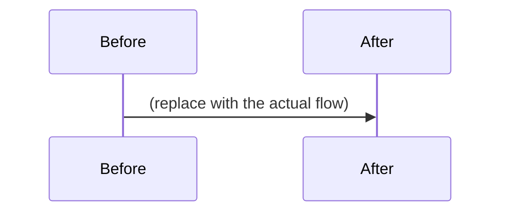

<!-- Thank you! Keep every section — write "n/a" if it truly does not apply.
     Visual evidence + a sequence/flow diagram are LAW, not preference.
     Fleet source: Andromeda /lessons — https://andromeda site /lessons/pr-template -->

## What changed

<!-- One or two sentences. What behaves differently after this PR? -->

## Why

<!-- The user-facing or architectural reason. Link the tracking ticket (BIN-*/HAB-*) if one exists. -->

## Sequence / flow diagram (REQUIRED for behavioral changes)

<!-- Show what the PR DOES as a diagram — a mermaid sequenceDiagram, flowchart,
     or stateDiagram of the behavior before/after. If nothing flows (pure
     docs/config), write "n/a — no behavior change".
     Render for review: `npx -p @mermaid-js/mermaid-cli mmdc -i <file>.mmd -o <file>.png`
     and attach the PNG (or commit under docs/pr-<N>/). -->

## Visual evidence

<!-- UI-affecting changes require rendered proof:
     PRs touching `web/**`: the Web Visual Diff workflow posts a screenshot
     diff table + left–right strips as a comment automatically once CI runs.
     Confirm it appeared and that every 🔴 row is intentional.
     PRs touching SwiftUI/AppKit surfaces: attach pointfree snapshot evidence
     (parity suite or recorded baselines) or rendered preview images. -->

- [ ] Visual diff comment reviewed — every 🔴 changed shot is intentional
- [ ] Sequence/flow diagram included above (or "n/a — no behavior change")

## Test plan

<!-- How you verified this yourself: exact commands, test names, or manual steps. -->

- [ ] Tests / build green locally — paste the command you ran

## Review gate — merge blockers

<!-- From swift-review-gate. Unchecked blocker = do not merge.
     Non-blockers: answer or write N/A. See /lessons/review-gate -->

- [ ] **Q1** Enums over magic strings — finite sets are enums + exhaustive switch
- [ ] **Q2** Codable on the wire — no hand-built JSON literals; canonical writer if byte-equality matters (Exhibit 13)
- [ ] **Q6** Actors / Sendable — shared mutable state isolated; `@unchecked Sendable` justified in writing
- [ ] **Q8** Emoji telemetry at every new decision point
- [ ] **Q9** Secrets & data posture — no ambient env inheritance, no PII in logs, brokered secrets
- [ ] **Q14** Exhaustive proof — CaseIterable tests, sequence diagram, snapshots if UI, receipts from a real run

Non-blockers (answer or N/A): Q3 expression · Q4 protocol vs enum · Q5 functional · Q7 lifetime · Q10 previews · Q11 snapshots · Q12 haptics/a11y · Q13 performance · Q15 simpler shape?

## Secrets / data posture

<!-- Any secrets, credentials, tokens, PII, or user data touched, added, or
     exposed? (Answer "none" explicitly if so.) -->

## Blast radius & rollback

<!-- What could this break outside its own module? How do we roll it back (revert commit / feature flag / migration down)? -->
